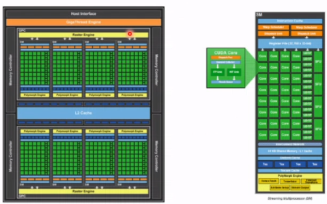
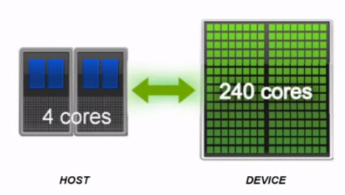
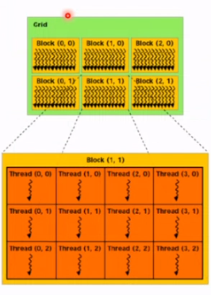
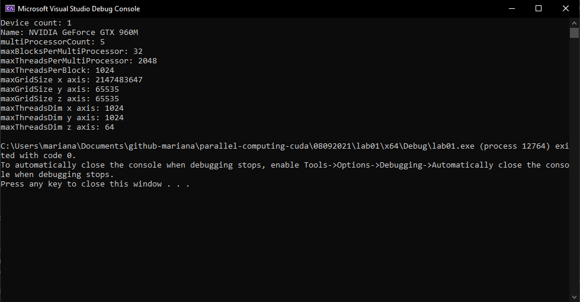

# Introduction: CUDA

CUDA is a hardware design and framework that allows the programming of the GPU nuclei and resource management.

## CUDA Architecture: Compute Unified Device Architecture)

---

- Architecture introduced in 2006.

- Allows the scientific community the access to the GPU resources.

- Brings support for high level programming languages, such as C/C++.

- Unifies the use of independent processors, which come from the classic architecture.

- Uses an Heterogeneous Model: this is formed with two hardware elements, Device and Host.

---

The Hardware (GPC) design has the following:

- SM Unit (all green squares and blues, etc), also called MultiProcessors. Each multiProcessor has a max limit of blocks that can be processed in this SM. These have:

    - SP Unit (each green square), also called CUDA cores or nucleus. Search for this in CUDA website.

- A cluster (GPC) is the group of SM's or Streaming Multiprocessors.

- L2 Cache Shared Memory

## Heterogeneous Model

- **Host**: CPU. Less cores or nuclei.

- **Device**: GPU or Graphics Card.

## Processing Stream

Starts with the Host (Sequential) and goes then to Device (Parallel) and then Host, etc...

## Kernel, Threads, blocks and Grids

- **Kernel**: gives the instructions to all the cores or organizes the cores. The code snippet that you want to execute in parallel.

- **Blocks**: cores are organized or grouped in blocks. The yellow squares. A block groups threads.

- **Grid**: a group of one or more blocks (Green big square). Each GPU has only one Grid.

- **Warp**: a group of 32 threads, they're inside blocks as blocks have threads. A warp **is** physically executed in parallel.

- A single thread is executed in a single CUDA core. Commonly: Thread = CUDA core.

Not every time everything runs in parallel, the first warp goes (32 threads per block) first, and then the next warp and so on. When a block is executed, not the whole block is executed, just its first 32 threads (warp), then other 32, etc.

 - A GPU is a group of multiprocessors.

- A block has threads, but you can have different amounts of threads in many blocks, just careful not to exceed `threadsInBlock x Blocks <= maxThreadsPerMultiProcessor`.

- Grids and blocks are three dimensional.

## Perspectives

- Hardware level: many cluster (multiprocessor)

- Software level: one 3D grid with blocks. 

## Lab 01 Output

The output on my personal machine looks as following: 

 