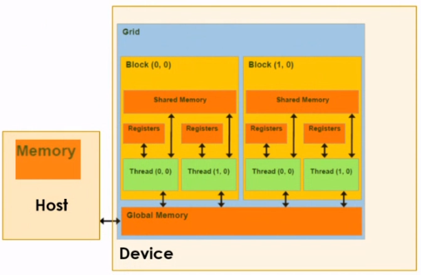

# Data Transfer and Memory Management

- A warp is the basic unit of grouping threads. We make this concept because a warp is physically executed.

- A block with 33 threads has 2 warps.

- A thread is executed in a CUDA core and a CUDA core is a processing nucleus.

---

A Host (CPU) and Device (GPU) have their own separate memory, CPU Memory and Global Memory respectively. CUDA creates functions to transfer info from one memory to another to connect these memories.

- **Global Memory** is a memory that is shared throughout all the blocks (and its threads) in a grid.

- **Shared Memory** is an independent memory exclusive to the threads in the block that has the said shared memory. It is a memory that each block has for its threads only, no other block has access to this.

- Each thread has its own memory, called **Register**, which is very quick access but limited in space.

<br />

### Memory Management (Reserve)

The Host will reserve dynamic memory with `malloc(size)` and the Device will reserve memory in the Device's Global Memory using `cudaMalloc(void**, size)`.

### Syntax & Example

- Host 

```c++
void* malloc(size_t size);
void free(void* _Block);
```

```c++
float* host_mem;
host_mem = (float*)malloc(sizeof(float));
free(host_mem);
```

- Device

```c++
cudaMalloc(void** devPtr, size_t size);
cudaFree(void* devPtr);
```

```c++
float* dev_mem;
cudaMalloc((void**)&dev_mem, sizeof(float));
cudaFree(dev_mem);
```

### Data Transfer

There are four types of data transfer, classified according to the direction of the transfer:

Type of Transfer | Direction Of Transfer | Description |
| ---- | ---- | ---- |
| cudaMemcpyHostToDevice | Host -> Device | Transfer data to be processed in parallel |
| cudaMemcpyDeviceToDevice | Device -> Device | Internal processing in the Device, without loops |
| cudaMemcpyDeviceToHost | Device -> Host | What was already processed in parallel, you return it to the Host to validate the info and see the results |
| cudaMemcpyHostToHost | Host -> Host | Normal CPU processing, but without loops (fast copy) |

### Syntax & Example

```c++
cudaMemcpy(destination_mem, source_mem, size, typeOfTransfer);
```

```c++
float* host_mem;
host_mem = (float*)malloc(sizeof(float));
float* dev_mem;
cudaMalloc((void**)&dev_mem, sizeof(float));

cudaMemcpy(dev_mem, host_mem, sizeof(float), cudaMemcpyHostToDevice);
```