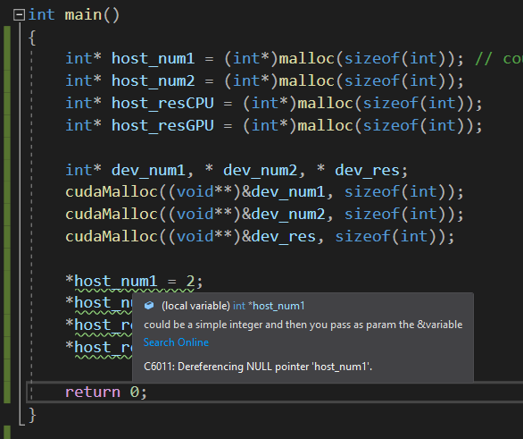
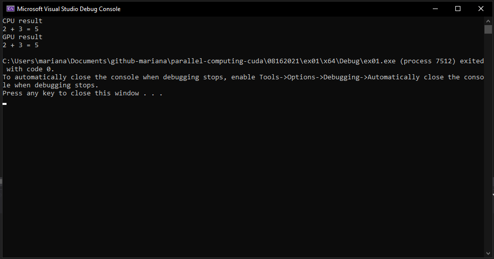

# The Kernel

It is a method executed in the GPU as a mass execution. As seen before, CUDA architecure's Processing flow is done switching between CPU and GPU. The kernel is a function you execute on the Device.

Specifier (Identifier) | Called From | Executed In | Syntax | Description |
| ---- | ---- | ---- | ---- | ---- |
| \_\_host\_\_ | Host | Host | \_\_float\_\_ float name() | CPU functions that are normally used in a program. You can skip the identifier, but it's good pratice. |
| \_\_global\_\_ | Host | Device | \_\_global\_\_ void name() | This identifier is for the **kernel**. Executed in the GPU, in parallel. |
| \_\_device\_\_ | Device | Device | \_\_device\_\_ float name() | This is executed in the device, but it's not exaclty a kernel (parallel), because it could or not be something in parallel. |

- If there is no specifier before a function, it is simply taken as a normal function in CPU processing. In this way, `__host__` is just a simple CPU function as well.

- `__device__` functions are defined throughout your code and then a kernel function calls it. Could be or not a parallel process function, it is just a method the kernel might need to be done.

- A **kernel** return value type is always void. If you want to return something, you do it by a reference pass using the kernel parameters.

- The specifier `__global__` creates a kernel.

- To call a kernel is to execute code in the GPU.

- **Synchronization**: when you want to wait for an action in parallel in order to begin another sequentially or viceversa.

## The Kernel Syntax

The kernel call is done in the CPU, the execution is in GPU.

```c++
__global__ void myKernel(arg_1, arg_2, ..., arg_n) {
    // code to be executed in the GPU
}

// from CPU you call the kernel
myKernel<<<blocks,threads>>>(arg_1, arg_2, ..., arg_n);
```

## Launching a Kernel

Basic Sequence:

1. Reserve memory in the host: this memory will be used for storing the info that will be processed in parallel.

2. Initialize the data from the host: this reserved memory is initialized with the said info to process in the GPU.

3. Data transfer from host to device: all this memory is in the host, and in order to process it in the device, we need to copy it to the device.

4. Launch the kernel specifying the number of blocks and threads: give the order of the execution of the function in the GPU, taking the transfered data to be processed.

5. Result data transfer from device to host: from the device memory, we copy the info back to the host so that it can be analized.

6. Free memory (device and host) from the host.

### Exercise 1

- A function that adds two integer numbers in the host (a simple add function).

- A function that adds two integer numbers in the device through the launch of a kernel.

```c++
#include "cuda_runtime.h"
#include "device_launch_parameters.h"

#include <stdio.h>
#include <stdlib.h>

__host__ int addCPU(int* num1, int* num2) {
    return(*num1 + *num2);
}

// kernel: __global__
__global__ void addGPU(int* num1, int* num2, int* res)
{
    *res = *num1 + *num2;
}

int main()
{
    // reserve mem in host
    int* host_num1 = (int*)malloc(sizeof(int)); // could be a simple integer and then you pass as param the &variable
    int* host_num2 = (int*)malloc(sizeof(int));
    int* host_resCPU = (int*)malloc(sizeof(int));
    int* host_resGPU = (int*)malloc(sizeof(int));

    // reserve mem in dev
    int* dev_num1, * dev_num2, * dev_res;
    cudaMalloc((void**)&dev_num1, sizeof(int)); // &3 error // &intvar no error but you need pointers with malloc in cuda
    cudaMalloc((void**)&dev_num2, sizeof(int));
    cudaMalloc((void**)&dev_res, sizeof(int)); // this pointer points to an address in the device

    // init data
    *host_num1 = 2;
    *host_num2 = 3;
    *host_resCPU = 0;
    *host_resGPU = 0;

    // data transfer
    cudaMemcpy(dev_num1, host_num1, sizeof(int), cudaMemcpyHostToDevice);
    cudaMemcpy(dev_num2, host_num2, sizeof(int), cudaMemcpyHostToDevice);

    // CPU call to CPU func
    *host_resCPU = addCPU(host_num1, host_num2);
    printf("CPU result \n");
    printf("%d + %d = %d \n", *host_num1, *host_num2, *host_resCPU);

    // CPU call to GPU func
    addGPU <<< 1, 1 >>> (dev_num1, dev_num2, dev_res);
    // dev_res is a pointer made with cudaMalloc (Global Memory)
    cudaMemcpy(host_resGPU, dev_res, sizeof(int), cudaMemcpyDeviceToHost);
    printf("GPU result \n");
    // dev_num1 is án address in GPU, you cannot access it from CPU
    printf("%d + %d = %d \n", *host_num1, *host_num2, *host_resGPU);

    // free memory
    free(host_num1);
    free(host_num2);
    free(host_resCPU);
    free(host_resGPU);

    cudaFree(dev_num1);
    cudaFree(dev_num2);
    cudaFree(dev_res);

    return 0;
}
```

At the line `int* host_num1 = (int*)malloc(sizeof(int));`, Visual Studio makes a suggestion, which is the same I put in the comment on that line. <br />

 <br />

## Output Example 01

My machine produces the following output. <br />

 <br />

## Code Alternatives

```c++
__global__ void addGPU(int num1, int num2, int* res)
{
    *res = num1 + num2;
}
int main(){
    addGPU <<< 1, 1 >>> (2, 3, dev_res);
}
```