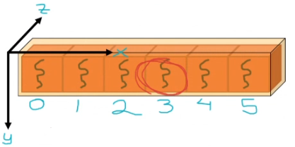
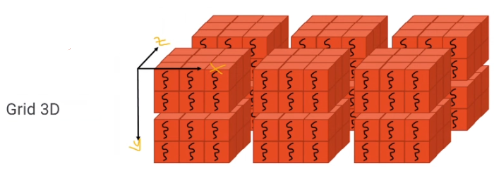

# Thread Identification

## Many Threads, One Block

- Threads (orange cubes) are contained or grouped in blocks (yellow container). In the image, there are six threads, one block. In this way, The kernel (function) will be executed by each thread at the same time (in parallel). This means that if we were to launch a kernel with this config (six threads one block), all we coded inside the kernel would be executed six times, one by each thread.


Blocks are tridimensional, as well as grids. The above block is one dimensional.

- To identify threads:

    - `threadIdx.x`: x axis index number of the thread. If you have only one block with six threads along one axis (one dimensional block), this property will be the full id. Indexes start in zero. It's y and z components are zero in one dimensional blocks, like the following image.

     

    In the case of **a one dimensional block**, a thread would be identified with only one property: `threadIdx.x`. Properties `threadIdx.y` and `threadIdx.z` are zero. For example, (3,0,0).

    - `threadIdx.y`: you will also need y component if your block is bidimensional, like the below image. Z component is zero in that case as well.

    

    In the case of **a two dimensional block**, to identify a thread in this single-block config, you would need two components: `threadIdx.x` and `threadIdx.y`, while `threadIdx.z` is zero. For example (4,1,0).

    - `threadIdx.z`: for the case of **a three dimensional block**, you will need a third component to identify threads in it, called `threadIdx.z`, which indicates the position of the thread in the z axis. For example, (4,0,1).

    

We need to identify threads in order to give instructions to particular threads inside the kernel. Then, **these indexes** will allow us to identify a thread inside **its block**. 

Most applications use **one dimensional blocks**. We said that we can identify a thread in a 1d block with its `threadIdx.x`, but this only works to identify threads if we have only 1 block.

- `globalId`: is the global id of a thread, which allows to identify a thread from **all others**. In the case of a one dimensional block, `globalID = threadIdx.x`. If the block and grid config is different, `globalId` is calculated differently.

- `dim3` objects have the properties x, y and z. We can determine the configuration of the grid (number of blocks per axis) using its default constructor `dim3 grid(3,1,1)`, for example. You can create a dim3 object to configure the dimensions of the blocks as well (threads quantity in each axis or direction of a block). Therefore,

    - `dim3 grid`: how are blocks organized in the grid, or *how many blocks will we launch with a kernel and how are these organized in the axes*. For example, `dim3 grid(3,1,1)` in the below image. (For one block, we would have `dim3 grid(1,1,1)`)

    

    Or bidimensional grids as with `dim3 grid(3,2,1)`:

    

    As well as three dimensional grids with the example of `dim3 grid(3,2,2)`:

    

    - `dim3 block`: how are threads organized in the blocks, *how a block is configured: how many threads and in which axes*.

## Example 1


For this case of one grid with a 1d block, the code would be:

```c++
#include "cuda_runtime.h"
#include "device_launch_parameters.h"

#include <stdio.h>
#include <stdlib.h>

__global__ void kernel()
{
    printf("threadIdx.x: %d, threadIdx.y: %d, threadIdx.z: %d \n", threadIdx.x, threadIdx.y, threadIdx.z);
}

int main() {
    dim3 grid(1, 1, 1); // dim3 grid(2, 1, 1); x = 012345012345 y = 0 in all 12, z = 0 in all 12
    dim3 block(6, 1, 1);
    kernel <<< grid, block >>> ();

    return 0;
}
```

Which would output:

```
threadIdx.x: 0, threadIdx.y: 0, threadIdx.z: 0
threadIdx.x: 1, threadIdx.y: 0, threadIdx.z: 0
threadIdx.x: 2, threadIdx.y: 0, threadIdx.z: 0
threadIdx.x: 3, threadIdx.y: 0, threadIdx.z: 0
threadIdx.x: 4, threadIdx.y: 0, threadIdx.z: 0
threadIdx.x: 5, threadIdx.y: 0, threadIdx.z: 0
```

## Example 2


For this case of 1 block with 6 threads in x and 2 in y axis:

```c++
__global__ void kernel()
{
    printf("threadIdx.x: %d, threadIdx.y: %d, threadIdx.z: %d \n", threadIdx.x, threadIdx.y, threadIdx.z);
}

int main() {
    dim3 grid(1, 1, 1); 
    dim3 block(6, 2, 1);
    kernel <<< grid, block >>> ();

    return 0;
}
```

Where its output is:

```
threadIdx.x: 0, threadIdx.y: 0, threadIdx.z: 0
threadIdx.x: 1, threadIdx.y: 0, threadIdx.z: 0
threadIdx.x: 2, threadIdx.y: 0, threadIdx.z: 0
threadIdx.x: 3, threadIdx.y: 0, threadIdx.z: 0
threadIdx.x: 4, threadIdx.y: 0, threadIdx.z: 0
threadIdx.x: 5, threadIdx.y: 0, threadIdx.z: 0
threadIdx.x: 0, threadIdx.y: 1, threadIdx.z: 0
threadIdx.x: 1, threadIdx.y: 1, threadIdx.z: 0
threadIdx.x: 2, threadIdx.y: 1, threadIdx.z: 0
threadIdx.x: 3, threadIdx.y: 1, threadIdx.z: 0
threadIdx.x: 4, threadIdx.y: 1, threadIdx.z: 0
threadIdx.x: 5, threadIdx.y: 1, threadIdx.z: 0
```

## Example 3


For this case of 1 block with 6 threads in x, 2 in y and 3 in z axis:

```c++
__global__ void kernel()
{
    printf("threadIdx.x: %d, threadIdx.y: %d, threadIdx.z: %d \n", threadIdx.x, threadIdx.y, threadIdx.z);
}

int main() {
    dim3 grid(1, 1, 1); 
    dim3 block(6, 2, 3);
    kernel <<< grid, block >>> ();

    return 0;
}
```

Where its output is:

```
threadIdx.x: 2, threadIdx.y: 1, threadIdx.z: 2
threadIdx.x: 3, threadIdx.y: 1, threadIdx.z: 2
threadIdx.x: 4, threadIdx.y: 1, threadIdx.z: 2
threadIdx.x: 5, threadIdx.y: 1, threadIdx.z: 2
threadIdx.x: 0, threadIdx.y: 0, threadIdx.z: 0
threadIdx.x: 1, threadIdx.y: 0, threadIdx.z: 0
threadIdx.x: 2, threadIdx.y: 0, threadIdx.z: 0
threadIdx.x: 3, threadIdx.y: 0, threadIdx.z: 0
threadIdx.x: 4, threadIdx.y: 0, threadIdx.z: 0
threadIdx.x: 5, threadIdx.y: 0, threadIdx.z: 0
threadIdx.x: 0, threadIdx.y: 1, threadIdx.z: 0
threadIdx.x: 1, threadIdx.y: 1, threadIdx.z: 0
threadIdx.x: 2, threadIdx.y: 1, threadIdx.z: 0
threadIdx.x: 3, threadIdx.y: 1, threadIdx.z: 0
threadIdx.x: 4, threadIdx.y: 1, threadIdx.z: 0
threadIdx.x: 5, threadIdx.y: 1, threadIdx.z: 0
threadIdx.x: 0, threadIdx.y: 0, threadIdx.z: 1
threadIdx.x: 1, threadIdx.y: 0, threadIdx.z: 1
threadIdx.x: 2, threadIdx.y: 0, threadIdx.z: 1
threadIdx.x: 3, threadIdx.y: 0, threadIdx.z: 1
threadIdx.x: 4, threadIdx.y: 0, threadIdx.z: 1
threadIdx.x: 5, threadIdx.y: 0, threadIdx.z: 1
threadIdx.x: 0, threadIdx.y: 1, threadIdx.z: 1
threadIdx.x: 1, threadIdx.y: 1, threadIdx.z: 1
threadIdx.x: 2, threadIdx.y: 1, threadIdx.z: 1
threadIdx.x: 3, threadIdx.y: 1, threadIdx.z: 1
threadIdx.x: 4, threadIdx.y: 1, threadIdx.z: 1
threadIdx.x: 5, threadIdx.y: 1, threadIdx.z: 1
threadIdx.x: 0, threadIdx.y: 0, threadIdx.z: 2
threadIdx.x: 1, threadIdx.y: 0, threadIdx.z: 2
threadIdx.x: 2, threadIdx.y: 0, threadIdx.z: 2
threadIdx.x: 3, threadIdx.y: 0, threadIdx.z: 2
threadIdx.x: 4, threadIdx.y: 0, threadIdx.z: 2
threadIdx.x: 5, threadIdx.y: 0, threadIdx.z: 2
threadIdx.x: 0, threadIdx.y: 1, threadIdx.z: 2
threadIdx.x: 1, threadIdx.y: 1, threadIdx.z: 2
```

They are not in order, because nothing guarantees that the threads will be in order. As soon as each thread finished printing, it appears on the screen.

Because of the repeated Ids, we have a *unique* Id for each thread in a block, called **globalId**.

## One Block & One Dimension


```c++
__global__ void printGlobalId_oneBlockOneDim()
{
    printf("GlobalId: %d\n", threadIdx.x);
}

int main() {
    dim3 grid(1, 1, 1); 
    dim3 block(6, 1, 1);
    printGlobalId_oneBlockOneDim <<< grid, block >>> ();

    return 0;
}
```

Which outputs:

```
threadIdx.x: 0
threadIdx.x: 1
threadIdx.x: 2
threadIdx.x: 3
threadIdx.x: 4
threadIdx.x: 5
```

## N Blocks, 1 Axis (One Dimension)


Then, because their threadIdx.x would be 012 012 012, we need:

> int globalId = threadIdx.x + blockDim.x * blockIdx.x;

```c++
__global__ void printGlobalId_NBlocksOneDim()
{
    int globalId = threadIdx.x + blockDim.x * blockIdx.x;
    printf("GlobalId: %d\n", globalId);
}

int main() {
    dim3 grid(3, 1, 1); 
    dim3 block(3, 1, 1);
    printGlobalId_NBlocksOneDim<<< grid, block >>> ();

    return 0;
}
```

Which outputs unique ids: 

```
GlobalId: 6
GlobalId: 7
GlobalId: 8
GlobalId: 3
GlobalId: 4
GlobalId: 5
GlobalId: 0
GlobalId: 1
GlobalId: 2
```

*Note: other config that is not N blocks in X axis, we need another formula.*

## To Finish

Then, completing the first function prints:

```c++
__global__ void kernel()
{
    int globalId = threadIdx.x + blockDim.x * blockIdx.x;
    printf("globalId: %d, threadIdx.x: %d, threadIdx.y: %d, threadIdx.z: %d, blockDim.x: %d, blockIdx.x %d\n", globalId, threadIdx.x, threadIdx.y, threadIdx.z, blockDim.x, blockIdx.x);
}
int main() {
    dim3 grid(3, 1, 1); 
    dim3 block(4, 1, 1);
    kernel<<< grid, block >>> ();

    return 0;
}
```

Which outputs (threads (threadIdx.x) **per block** is ordered): 

```
globalId: 8, threadIdx.x: 0, threadIdx.y: 0, threadIdx.z: 0, blockDim.x: 4, blockIdx.x 2
globalId: 9, threadIdx.x: 1, threadIdx.y: 0, threadIdx.z: 0, blockDim.x: 4, blockIdx.x 2
globalId: 10, threadIdx.x: 2, threadIdx.y: 0, threadIdx.z: 0, blockDim.x: 4, blockIdx.x 2
globalId: 11, threadIdx.x: 3, threadIdx.y: 0, threadIdx.z: 0, blockDim.x: 4, blockIdx.x 2
globalId: 4, threadIdx.x: 0, threadIdx.y: 0, threadIdx.z: 0, blockDim.x: 4, blockIdx.x 1
globalId: 5, threadIdx.x: 1, threadIdx.y: 0, threadIdx.z: 0, blockDim.x: 4, blockIdx.x 1
globalId: 6, threadIdx.x: 2, threadIdx.y: 0, threadIdx.z: 0, blockDim.x: 4, blockIdx.x 1
globalId: 7, threadIdx.x: 3, threadIdx.y: 0, threadIdx.z: 0, blockDim.x: 4, blockIdx.x 1
globalId: 0, threadIdx.x: 0, threadIdx.y: 0, threadIdx.z: 0, blockDim.x: 4, blockIdx.x 0
globalId: 1, threadIdx.x: 1, threadIdx.y: 0, threadIdx.z: 0, blockDim.x: 4, blockIdx.x 0
globalId: 2, threadIdx.x: 2, threadIdx.y: 0, threadIdx.z: 0, blockDim.x: 4, blockIdx.x 0
globalId: 3, threadIdx.x: 3, threadIdx.y: 0, threadIdx.z: 0, blockDim.x: 4, blockIdx.x 0
```
