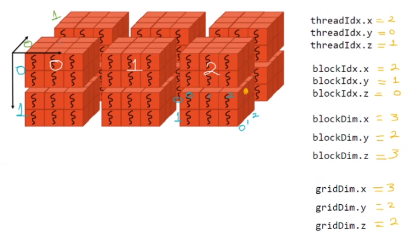
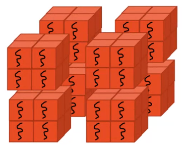

# Other Configs (3D Grid with 3D Blocks)

- Properties `threadIdx.x`, `threadIdx.y` and `threadIdx.z` are used to identify a thread **inside its block**.

- When we have a much more complicated grid, we need additional indexes apart from these in order to calculate **gloablId** values, which will take on account other blocks in the config.

    - `blockIdx`: determines the index of a block inside a grid. Indexes start in zero. It has x,y,z values.

    - `blockDim`: how many **threads** per dimension are in a block. These are **quantity values**, not indexes, and therefore are constant for all threads. It has x,y,z values.

    - `gridDim`: how many **blocks** per dimension are in the **grid**. These are **quantity values**, not indexes, and therefore are constant for all threads. It has x,y,z values.

 

## Lab 04

Make a program in c/c++ using CUDA in which you implement a grid in 3D that has 4 threads in each dimension and 2 threads per block dimension. The program must print from kernel the values of the following indexes, considering their three dimensions:

- threadIdx

- blockIdx

- blockDim

- gridDim

Like the image below:

 

### Solution

```c++
#include "cuda_runtime.h"
#include "device_launch_parameters.h"

#include <stdio.h>
#include <stdlib.h>

__global__ void kernel()
{
    printf("threadIdx.x: %d, threadIdx.y: %d, threadIdx.z: %d | blockIdx.x: %d, blockIdx.y: %d, blockIdx.z: %d | blockDim.x: %d, blockDim.y: %d, blockDim.z: %d | gridDim.x: %d, gridDim.y: %d, gridDim.z: %d\n", 
        threadIdx.x, threadIdx.y, threadIdx.z, 
        blockIdx.x, blockIdx.y, blockIdx.z,
        blockDim.x, blockDim.y, blockDim.z,
        gridDim.x, gridDim.y, gridDim.z);
}

int main() {
    dim3 grid(2, 2, 2);
    dim3 block(2, 2, 2);
    kernel <<< grid, block >>> ();

    return 0;
}
```

Which outputs 64 lines:

```
threadIdx.x: 0, threadIdx.y: 0, threadIdx.z: 0 | blockIdx.x: 1, blockIdx.y: 0, blockIdx.z: 0 | blockDim.x: 2, blockDim.y: 2, blockDim.z: 2 | gridDim.x: 2, gridDim.y: 2, gridDim.z: 2
threadIdx.x: 1, threadIdx.y: 0, threadIdx.z: 0 | blockIdx.x: 1, blockIdx.y: 0, blockIdx.z: 0 | blockDim.x: 2, blockDim.y: 2, blockDim.z: 2 | gridDim.x: 2, gridDim.y: 2, gridDim.z: 2
threadIdx.x: 0, threadIdx.y: 1, threadIdx.z: 0 | blockIdx.x: 1, blockIdx.y: 0, blockIdx.z: 0 | blockDim.x: 2, blockDim.y: 2, blockDim.z: 2 | gridDim.x: 2, gridDim.y: 2, gridDim.z: 2
threadIdx.x: 1, threadIdx.y: 1, threadIdx.z: 0 | blockIdx.x: 1, blockIdx.y: 0, blockIdx.z: 0 | blockDim.x: 2, blockDim.y: 2, blockDim.z: 2 | gridDim.x: 2, gridDim.y: 2, gridDim.z: 2
threadIdx.x: 0, threadIdx.y: 0, threadIdx.z: 1 | blockIdx.x: 1, blockIdx.y: 0, blockIdx.z: 0 | blockDim.x: 2, blockDim.y: 2, blockDim.z: 2 | gridDim.x: 2, gridDim.y: 2, gridDim.z: 2
threadIdx.x: 1, threadIdx.y: 0, threadIdx.z: 1 | blockIdx.x: 1, blockIdx.y: 0, blockIdx.z: 0 | blockDim.x: 2, blockDim.y: 2, blockDim.z: 2 | gridDim.x: 2, gridDim.y: 2, gridDim.z: 2
threadIdx.x: 0, threadIdx.y: 1, threadIdx.z: 1 | blockIdx.x: 1, blockIdx.y: 0, blockIdx.z: 0 | blockDim.x: 2, blockDim.y: 2, blockDim.z: 2 | gridDim.x: 2, gridDim.y: 2, gridDim.z: 2
threadIdx.x: 1, threadIdx.y: 1, threadIdx.z: 1 | blockIdx.x: 1, blockIdx.y: 0, blockIdx.z: 0 | blockDim.x: 2, blockDim.y: 2, blockDim.z: 2 | gridDim.x: 2, gridDim.y: 2, gridDim.z: 2
threadIdx.x: 0, threadIdx.y: 0, threadIdx.z: 0 | blockIdx.x: 0, blockIdx.y: 0, blockIdx.z: 1 | blockDim.x: 2, blockDim.y: 2, blockDim.z: 2 | gridDim.x: 2, gridDim.y: 2, gridDim.z: 2
threadIdx.x: 1, threadIdx.y: 0, threadIdx.z: 0 | blockIdx.x: 0, blockIdx.y: 0, blockIdx.z: 1 | blockDim.x: 2, blockDim.y: 2, blockDim.z: 2 | gridDim.x: 2, gridDim.y: 2, gridDim.z: 2
threadIdx.x: 0, threadIdx.y: 1, threadIdx.z: 0 | blockIdx.x: 0, blockIdx.y: 0, blockIdx.z: 1 | blockDim.x: 2, blockDim.y: 2, blockDim.z: 2 | gridDim.x: 2, gridDim.y: 2, gridDim.z: 2
threadIdx.x: 1, threadIdx.y: 1, threadIdx.z: 0 | blockIdx.x: 0, blockIdx.y: 0, blockIdx.z: 1 | blockDim.x: 2, blockDim.y: 2, blockDim.z: 2 | gridDim.x: 2, gridDim.y: 2, gridDim.z: 2
threadIdx.x: 0, threadIdx.y: 0, threadIdx.z: 1 | blockIdx.x: 0, blockIdx.y: 0, blockIdx.z: 1 | blockDim.x: 2, blockDim.y: 2, blockDim.z: 2 | gridDim.x: 2, gridDim.y: 2, gridDim.z: 2
threadIdx.x: 1, threadIdx.y: 0, threadIdx.z: 1 | blockIdx.x: 0, blockIdx.y: 0, blockIdx.z: 1 | blockDim.x: 2, blockDim.y: 2, blockDim.z: 2 | gridDim.x: 2, gridDim.y: 2, gridDim.z: 2
threadIdx.x: 0, threadIdx.y: 1, threadIdx.z: 1 | blockIdx.x: 0, blockIdx.y: 0, blockIdx.z: 1 | blockDim.x: 2, blockDim.y: 2, blockDim.z: 2 | gridDim.x: 2, gridDim.y: 2, gridDim.z: 2
threadIdx.x: 1, threadIdx.y: 1, threadIdx.z: 1 | blockIdx.x: 0, blockIdx.y: 0, blockIdx.z: 1 | blockDim.x: 2, blockDim.y: 2, blockDim.z: 2 | gridDim.x: 2, gridDim.y: 2, gridDim.z: 2
threadIdx.x: 0, threadIdx.y: 0, threadIdx.z: 0 | blockIdx.x: 1, blockIdx.y: 1, blockIdx.z: 0 | blockDim.x: 2, blockDim.y: 2, blockDim.z: 2 | gridDim.x: 2, gridDim.y: 2, gridDim.z: 2
threadIdx.x: 1, threadIdx.y: 0, threadIdx.z: 0 | blockIdx.x: 1, blockIdx.y: 1, blockIdx.z: 0 | blockDim.x: 2, blockDim.y: 2, blockDim.z: 2 | gridDim.x: 2, gridDim.y: 2, gridDim.z: 2
threadIdx.x: 0, threadIdx.y: 1, threadIdx.z: 0 | blockIdx.x: 1, blockIdx.y: 1, blockIdx.z: 0 | blockDim.x: 2, blockDim.y: 2, blockDim.z: 2 | gridDim.x: 2, gridDim.y: 2, gridDim.z: 2
threadIdx.x: 1, threadIdx.y: 1, threadIdx.z: 0 | blockIdx.x: 1, blockIdx.y: 1, blockIdx.z: 0 | blockDim.x: 2, blockDim.y: 2, blockDim.z: 2 | gridDim.x: 2, gridDim.y: 2, gridDim.z: 2
threadIdx.x: 0, threadIdx.y: 0, threadIdx.z: 1 | blockIdx.x: 1, blockIdx.y: 1, blockIdx.z: 0 | blockDim.x: 2, blockDim.y: 2, blockDim.z: 2 | gridDim.x: 2, gridDim.y: 2, gridDim.z: 2
threadIdx.x: 1, threadIdx.y: 0, threadIdx.z: 1 | blockIdx.x: 1, blockIdx.y: 1, blockIdx.z: 0 | blockDim.x: 2, blockDim.y: 2, blockDim.z: 2 | gridDim.x: 2, gridDim.y: 2, gridDim.z: 2
threadIdx.x: 0, threadIdx.y: 1, threadIdx.z: 1 | blockIdx.x: 1, blockIdx.y: 1, blockIdx.z: 0 | blockDim.x: 2, blockDim.y: 2, blockDim.z: 2 | gridDim.x: 2, gridDim.y: 2, gridDim.z: 2
threadIdx.x: 1, threadIdx.y: 1, threadIdx.z: 1 | blockIdx.x: 1, blockIdx.y: 1, blockIdx.z: 0 | blockDim.x: 2, blockDim.y: 2, blockDim.z: 2 | gridDim.x: 2, gridDim.y: 2, gridDim.z: 2
threadIdx.x: 0, threadIdx.y: 0, threadIdx.z: 0 | blockIdx.x: 0, blockIdx.y: 1, blockIdx.z: 0 | blockDim.x: 2, blockDim.y: 2, blockDim.z: 2 | gridDim.x: 2, gridDim.y: 2, gridDim.z: 2
threadIdx.x: 1, threadIdx.y: 0, threadIdx.z: 0 | blockIdx.x: 0, blockIdx.y: 1, blockIdx.z: 0 | blockDim.x: 2, blockDim.y: 2, blockDim.z: 2 | gridDim.x: 2, gridDim.y: 2, gridDim.z: 2
threadIdx.x: 0, threadIdx.y: 1, threadIdx.z: 0 | blockIdx.x: 0, blockIdx.y: 1, blockIdx.z: 0 | blockDim.x: 2, blockDim.y: 2, blockDim.z: 2 | gridDim.x: 2, gridDim.y: 2, gridDim.z: 2
threadIdx.x: 1, threadIdx.y: 1, threadIdx.z: 0 | blockIdx.x: 0, blockIdx.y: 1, blockIdx.z: 0 | blockDim.x: 2, blockDim.y: 2, blockDim.z: 2 | gridDim.x: 2, gridDim.y: 2, gridDim.z: 2
threadIdx.x: 0, threadIdx.y: 0, threadIdx.z: 1 | blockIdx.x: 0, blockIdx.y: 1, blockIdx.z: 0 | blockDim.x: 2, blockDim.y: 2, blockDim.z: 2 | gridDim.x: 2, gridDim.y: 2, gridDim.z: 2
threadIdx.x: 1, threadIdx.y: 0, threadIdx.z: 1 | blockIdx.x: 0, blockIdx.y: 1, blockIdx.z: 0 | blockDim.x: 2, blockDim.y: 2, blockDim.z: 2 | gridDim.x: 2, gridDim.y: 2, gridDim.z: 2
threadIdx.x: 0, threadIdx.y: 1, threadIdx.z: 1 | blockIdx.x: 0, blockIdx.y: 1, blockIdx.z: 0 | blockDim.x: 2, blockDim.y: 2, blockDim.z: 2 | gridDim.x: 2, gridDim.y: 2, gridDim.z: 2
threadIdx.x: 1, threadIdx.y: 1, threadIdx.z: 1 | blockIdx.x: 0, blockIdx.y: 1, blockIdx.z: 0 | blockDim.x: 2, blockDim.y: 2, blockDim.z: 2 | gridDim.x: 2, gridDim.y: 2, gridDim.z: 2
threadIdx.x: 0, threadIdx.y: 0, threadIdx.z: 0 | blockIdx.x: 0, blockIdx.y: 0, blockIdx.z: 0 | blockDim.x: 2, blockDim.y: 2, blockDim.z: 2 | gridDim.x: 2, gridDim.y: 2, gridDim.z: 2
threadIdx.x: 1, threadIdx.y: 0, threadIdx.z: 0 | blockIdx.x: 0, blockIdx.y: 0, blockIdx.z: 0 | blockDim.x: 2, blockDim.y: 2, blockDim.z: 2 | gridDim.x: 2, gridDim.y: 2, gridDim.z: 2
threadIdx.x: 0, threadIdx.y: 1, threadIdx.z: 0 | blockIdx.x: 0, blockIdx.y: 0, blockIdx.z: 0 | blockDim.x: 2, blockDim.y: 2, blockDim.z: 2 | gridDim.x: 2, gridDim.y: 2, gridDim.z: 2
threadIdx.x: 1, threadIdx.y: 1, threadIdx.z: 0 | blockIdx.x: 0, blockIdx.y: 0, blockIdx.z: 0 | blockDim.x: 2, blockDim.y: 2, blockDim.z: 2 | gridDim.x: 2, gridDim.y: 2, gridDim.z: 2
threadIdx.x: 0, threadIdx.y: 0, threadIdx.z: 1 | blockIdx.x: 0, blockIdx.y: 0, blockIdx.z: 0 | blockDim.x: 2, blockDim.y: 2, blockDim.z: 2 | gridDim.x: 2, gridDim.y: 2, gridDim.z: 2
threadIdx.x: 1, threadIdx.y: 0, threadIdx.z: 1 | blockIdx.x: 0, blockIdx.y: 0, blockIdx.z: 0 | blockDim.x: 2, blockDim.y: 2, blockDim.z: 2 | gridDim.x: 2, gridDim.y: 2, gridDim.z: 2
threadIdx.x: 0, threadIdx.y: 1, threadIdx.z: 1 | blockIdx.x: 0, blockIdx.y: 0, blockIdx.z: 0 | blockDim.x: 2, blockDim.y: 2, blockDim.z: 2 | gridDim.x: 2, gridDim.y: 2, gridDim.z: 2
threadIdx.x: 1, threadIdx.y: 1, threadIdx.z: 1 | blockIdx.x: 0, blockIdx.y: 0, blockIdx.z: 0 | blockDim.x: 2, blockDim.y: 2, blockDim.z: 2 | gridDim.x: 2, gridDim.y: 2, gridDim.z: 2
threadIdx.x: 0, threadIdx.y: 0, threadIdx.z: 0 | blockIdx.x: 0, blockIdx.y: 1, blockIdx.z: 1 | blockDim.x: 2, blockDim.y: 2, blockDim.z: 2 | gridDim.x: 2, gridDim.y: 2, gridDim.z: 2
threadIdx.x: 1, threadIdx.y: 0, threadIdx.z: 0 | blockIdx.x: 0, blockIdx.y: 1, blockIdx.z: 1 | blockDim.x: 2, blockDim.y: 2, blockDim.z: 2 | gridDim.x: 2, gridDim.y: 2, gridDim.z: 2
threadIdx.x: 0, threadIdx.y: 1, threadIdx.z: 0 | blockIdx.x: 0, blockIdx.y: 1, blockIdx.z: 1 | blockDim.x: 2, blockDim.y: 2, blockDim.z: 2 | gridDim.x: 2, gridDim.y: 2, gridDim.z: 2
threadIdx.x: 1, threadIdx.y: 1, threadIdx.z: 0 | blockIdx.x: 0, blockIdx.y: 1, blockIdx.z: 1 | blockDim.x: 2, blockDim.y: 2, blockDim.z: 2 | gridDim.x: 2, gridDim.y: 2, gridDim.z: 2
threadIdx.x: 0, threadIdx.y: 0, threadIdx.z: 1 | blockIdx.x: 0, blockIdx.y: 1, blockIdx.z: 1 | blockDim.x: 2, blockDim.y: 2, blockDim.z: 2 | gridDim.x: 2, gridDim.y: 2, gridDim.z: 2
threadIdx.x: 1, threadIdx.y: 0, threadIdx.z: 1 | blockIdx.x: 0, blockIdx.y: 1, blockIdx.z: 1 | blockDim.x: 2, blockDim.y: 2, blockDim.z: 2 | gridDim.x: 2, gridDim.y: 2, gridDim.z: 2
threadIdx.x: 0, threadIdx.y: 1, threadIdx.z: 1 | blockIdx.x: 0, blockIdx.y: 1, blockIdx.z: 1 | blockDim.x: 2, blockDim.y: 2, blockDim.z: 2 | gridDim.x: 2, gridDim.y: 2, gridDim.z: 2
threadIdx.x: 1, threadIdx.y: 1, threadIdx.z: 1 | blockIdx.x: 0, blockIdx.y: 1, blockIdx.z: 1 | blockDim.x: 2, blockDim.y: 2, blockDim.z: 2 | gridDim.x: 2, gridDim.y: 2, gridDim.z: 2
threadIdx.x: 0, threadIdx.y: 0, threadIdx.z: 0 | blockIdx.x: 1, blockIdx.y: 1, blockIdx.z: 1 | blockDim.x: 2, blockDim.y: 2, blockDim.z: 2 | gridDim.x: 2, gridDim.y: 2, gridDim.z: 2
threadIdx.x: 1, threadIdx.y: 0, threadIdx.z: 0 | blockIdx.x: 1, blockIdx.y: 1, blockIdx.z: 1 | blockDim.x: 2, blockDim.y: 2, blockDim.z: 2 | gridDim.x: 2, gridDim.y: 2, gridDim.z: 2
threadIdx.x: 0, threadIdx.y: 1, threadIdx.z: 0 | blockIdx.x: 1, blockIdx.y: 1, blockIdx.z: 1 | blockDim.x: 2, blockDim.y: 2, blockDim.z: 2 | gridDim.x: 2, gridDim.y: 2, gridDim.z: 2
threadIdx.x: 1, threadIdx.y: 1, threadIdx.z: 0 | blockIdx.x: 1, blockIdx.y: 1, blockIdx.z: 1 | blockDim.x: 2, blockDim.y: 2, blockDim.z: 2 | gridDim.x: 2, gridDim.y: 2, gridDim.z: 2
threadIdx.x: 0, threadIdx.y: 0, threadIdx.z: 1 | blockIdx.x: 1, blockIdx.y: 1, blockIdx.z: 1 | blockDim.x: 2, blockDim.y: 2, blockDim.z: 2 | gridDim.x: 2, gridDim.y: 2, gridDim.z: 2
threadIdx.x: 1, threadIdx.y: 0, threadIdx.z: 1 | blockIdx.x: 1, blockIdx.y: 1, blockIdx.z: 1 | blockDim.x: 2, blockDim.y: 2, blockDim.z: 2 | gridDim.x: 2, gridDim.y: 2, gridDim.z: 2
threadIdx.x: 0, threadIdx.y: 1, threadIdx.z: 1 | blockIdx.x: 1, blockIdx.y: 1, blockIdx.z: 1 | blockDim.x: 2, blockDim.y: 2, blockDim.z: 2 | gridDim.x: 2, gridDim.y: 2, gridDim.z: 2
threadIdx.x: 1, threadIdx.y: 1, threadIdx.z: 1 | blockIdx.x: 1, blockIdx.y: 1, blockIdx.z: 1 | blockDim.x: 2, blockDim.y: 2, blockDim.z: 2 | gridDim.x: 2, gridDim.y: 2, gridDim.z: 2
threadIdx.x: 0, threadIdx.y: 0, threadIdx.z: 0 | blockIdx.x: 1, blockIdx.y: 0, blockIdx.z: 1 | blockDim.x: 2, blockDim.y: 2, blockDim.z: 2 | gridDim.x: 2, gridDim.y: 2, gridDim.z: 2
threadIdx.x: 1, threadIdx.y: 0, threadIdx.z: 0 | blockIdx.x: 1, blockIdx.y: 0, blockIdx.z: 1 | blockDim.x: 2, blockDim.y: 2, blockDim.z: 2 | gridDim.x: 2, gridDim.y: 2, gridDim.z: 2
threadIdx.x: 0, threadIdx.y: 1, threadIdx.z: 0 | blockIdx.x: 1, blockIdx.y: 0, blockIdx.z: 1 | blockDim.x: 2, blockDim.y: 2, blockDim.z: 2 | gridDim.x: 2, gridDim.y: 2, gridDim.z: 2
threadIdx.x: 1, threadIdx.y: 1, threadIdx.z: 0 | blockIdx.x: 1, blockIdx.y: 0, blockIdx.z: 1 | blockDim.x: 2, blockDim.y: 2, blockDim.z: 2 | gridDim.x: 2, gridDim.y: 2, gridDim.z: 2
threadIdx.x: 0, threadIdx.y: 0, threadIdx.z: 1 | blockIdx.x: 1, blockIdx.y: 0, blockIdx.z: 1 | blockDim.x: 2, blockDim.y: 2, blockDim.z: 2 | gridDim.x: 2, gridDim.y: 2, gridDim.z: 2
threadIdx.x: 1, threadIdx.y: 0, threadIdx.z: 1 | blockIdx.x: 1, blockIdx.y: 0, blockIdx.z: 1 | blockDim.x: 2, blockDim.y: 2, blockDim.z: 2 | gridDim.x: 2, gridDim.y: 2, gridDim.z: 2
threadIdx.x: 0, threadIdx.y: 1, threadIdx.z: 1 | blockIdx.x: 1, blockIdx.y: 0, blockIdx.z: 1 | blockDim.x: 2, blockDim.y: 2, blockDim.z: 2 | gridDim.x: 2, gridDim.y: 2, gridDim.z: 2
threadIdx.x: 1, threadIdx.y: 1, threadIdx.z: 1 | blockIdx.x: 1, blockIdx.y: 0, blockIdx.z: 1 | blockDim.x: 2, blockDim.y: 2, blockDim.z: 2 | gridDim.x: 2, gridDim.y: 2, gridDim.z: 2
```