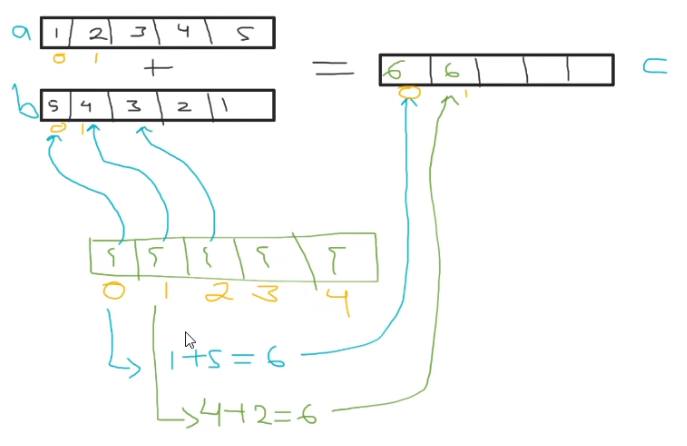
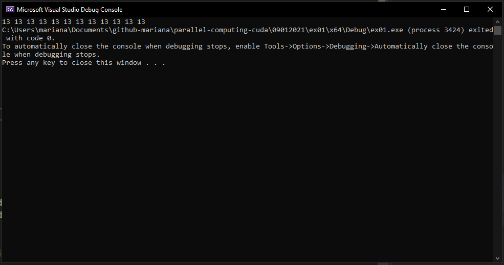

# Practice

- If you launch a kernel with 1 block and this block has only 1 dimension: `globalId = threadIdx.x`. A globalId is important because it allows us to identify a thread from another with a **unique** value. 

- If we change the configuration and we launch a kernel with N one-dimensional blocks along 1 grid axis, the `globalId = threadIdx.x + blockDim.x * blockIdx.x`. The block ids are the same for threads inside its block.

- The kernel is in charge of massive processing. The kernel function will be executed in parallel N times, through the N threads: each thread will work with different data but applying the same operations to this data, which are written as the kernel code. We need to identify the thread (globalId) in order to give the thread different data to perform its kernel code.

## Exercise 1

The idea is to have two vectors (arrays) of size 12 each, and sum its elements to store them in a third array, of size 12 as well: first element of A + first element of B, stored on the first element of C and so on.



- Each thread will be in charge of doing the sum of two elements. We need 12 sums, and therefore we will use 12 threads. We will use 1 one-dimensional block with 12 threads, in order to make it easier to direct a thread to its assigned sum of values and its assigned storage cell, using its `threadIdx.x`.

- If we were to do this with a for loop, we would be doing **sequential programming**, because first we sum the first elements of the arrays, and then move to the second elements, and so on **sequentially**: this makes it possible to do one sum at a time. With CUDA, we would reduce this time, because we would do all 12 sums at the same time.

- The instruction is the same for all threads, the only thing that changes is the data with which this operation/instruction will be done by each thread. In this case, the globalId will be useful to locate the data to process in arrays a and b, but also to assign the thread that will operate this data.

- The kernel will be executed N times, one by each of the N threads. 12 threads will execute the two lines of code inside the kernel: there will be 12 gId vars (one for each thread), this `gId` variable can be considered as a **different** variable for each thread.

### Solution

```c++
#include "cuda_runtime.h"
#include "device_launch_parameters.h"

#include <stdio.h>
#include <stdlib.h>


__global__ void arraySum(int* dev_a, int* dev_b, int* dev_c) {
    // 1block and this with one dimension
    int gId = threadIdx.x; // there will be 12 gId variables when all threads are executing the kernel
    // 12 vars, one for each thread
    dev_c[gId] = dev_a[gId] + dev_b[gId];
}

int main()
{
    const int vectorSize = 12;
    int host_a[] = { 1, 2, 3, 4, 5, 6, 7, 8, 9, 10, 11, 12 };
    int host_b[] = { 12, 11, 10, 9, 8, 7, 6, 5, 4, 3, 2, 1 };
    int host_c[vectorSize] = { 0 };

    int* dev_a, * dev_b, * dev_c;
    cudaMalloc((void**)&dev_a, sizeof(int) * vectorSize);
    cudaMalloc((void**)&dev_b, sizeof(int) * vectorSize);
    cudaMalloc((void**)&dev_c, sizeof(int) * vectorSize);

    cudaMemcpy(dev_a, host_a, sizeof(int) * vectorSize, cudaMemcpyHostToDevice);
    cudaMemcpy(dev_b, host_b, sizeof(int) * vectorSize, cudaMemcpyHostToDevice);

    dim3 grid(1, 1, 1); // or dim3 grid(1);
    dim3 block(vectorSize, 1, 1); // or dim3 block(vectorSize);

    arraySum << < grid, block >> > (dev_a, dev_b, dev_c);

    cudaMemcpy(host_c, dev_c, sizeof(int) * vectorSize, cudaMemcpyDeviceToHost);

    for (int i = 0; i < vectorSize; i++) {
        printf("%d ", host_c[i]);
    }

    cudaFree(dev_a);
    cudaFree(dev_b);
    cudaFree(dev_c);

    return 0;
}
```
### Output



- For example, when working with images, as they are matrices, the best thing to do is to configure the blocks to be of dimensions similar to those image matrices: a bidimensional block to use the threadIdx x and y components.
