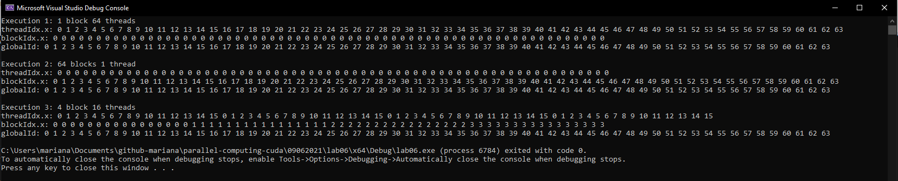

# Practice

## Lab 05

Make a program in c/c++ using CUDA in which you implement a kernel that adds two arrays (A and B) of integers generated randomly, considering the requirements:

- 32 threads

- A 1D grid with 4 blocks

- Use 1D blocks with 8 threads in each block 

- Array size must be of 32

### Solution

```c++
#include "cuda_runtime.h"
#include "device_launch_parameters.h"
#include <stdio.h>
#include <stdlib.h> /* srand, rand */
#include <time.h> /* time */
__global__ void sumaVectores(int* vecA, int* vecB, int* vecRes) {
	int gId = threadIdx.x + blockDim.x * blockIdx.x;
	vecRes[gId] = vecA[gId] + vecB[gId];
}
int main()
{
	const int vectorSize = 32;
	int* host_a = (int*)malloc(sizeof(int) * vectorSize);
	int* host_b = (int*)malloc(sizeof(int) * vectorSize);
	int* host_c = (int*)malloc(sizeof(int) * vectorSize);

	int* dev_a, * dev_b, * dev_c;

	cudaMalloc((void**)&dev_a, sizeof(int) * vectorSize);
	cudaMalloc((void**)&dev_b, sizeof(int) * vectorSize);
	cudaMalloc((void**)&dev_c, sizeof(int) * vectorSize);

	srand(time(NULL));

	for (int i = 0; i < vectorSize; i++) {
		int num = rand() % vectorSize + 1;
		host_a[i] = num;
		num = rand() % vectorSize + 1;
		host_b[i] = num;
	}

	cudaMemcpy(dev_a, host_a, sizeof(int) * vectorSize, cudaMemcpyHostToDevice);
	cudaMemcpy(dev_b, host_b, sizeof(int) * vectorSize, cudaMemcpyHostToDevice);
	dim3 grid(4, 1, 1);
	dim3 block(8, 1, 1);

	sumaVectores << < grid, block >> > (dev_a, dev_b, dev_c);

	cudaMemcpy(host_c, dev_c, sizeof(int) * vectorSize, cudaMemcpyDeviceToHost);

	printf("Vector A: \n");
	for (int i = 0; i < vectorSize; i++) {
		printf("%d ", host_a[i]);
	}
	printf("\nVector B: \n");
	for (int i = 0; i < vectorSize; i++) {
		printf("%d ", host_b[i]);
	}
	printf("\nVector C: \n");
	for (int i = 0; i < vectorSize; i++) {
		printf("%d ", host_c[i]);
	}

	free(host_a);
	free(host_b);
	free(host_c);
	cudaFree(dev_a);
	cudaFree(dev_b);
	cudaFree(dev_c);
	return 0;
}
```

## Lab 06

Make a program in c/c++ using CUDA in which you implement a kernel that assigns the different identification indexes for the threads into three arrays (A, B and C) considering the requirements:

- Use 3 arrays of integers with 64 elements each

- The kernel must manage 64 threads

- Each thread must write in an array a thread index:

    - The thread id (threadIdx.x) in array A

    - The block index (blockIdx.x) in array B

    - The global index (globalId = thread.x + blockDim.x * blockIdx.x) in the C array

- The kernel must execute 3 times, each with the structure:

    - 1 block of 64 threads

    - 64 blocks of 1 thread

    - 4 blocks of 16 threads

- Print the results from main function, with a text indicating the config of each execution.

### Solution

```c++
#include "cuda_runtime.h"
#include "device_launch_parameters.h"
#include <stdio.h>
#include <stdlib.h> /* srand, rand */
#include <time.h> /* time */

#include<iostream>
using namespace std;
__global__ void idKernel(int* vecA, int* vecB, int* vecC) {
	int gId = threadIdx.x + blockDim.x * blockIdx.x;

	vecA[gId] = threadIdx.x;
	vecB[gId] = blockIdx.x;
	vecC[gId] = gId;
}

void printArray(int* arr, int size, char * msg) {
	cout << msg << ": ";
	for (int i = 0; i < size; i++) {
		printf("%d ", arr[i]);
	}
	printf("\n");
}

int main()
{
	const int vectorSize = 64;
	int* host_a = (int*)malloc(sizeof(int) * vectorSize);
	int* host_b = (int*)malloc(sizeof(int) * vectorSize);
	int* host_c = (int*)malloc(sizeof(int) * vectorSize);

	int* dev_a, * dev_b, * dev_c;

	cudaMalloc((void**)&dev_a, sizeof(int) * vectorSize);
	cudaMalloc((void**)&dev_b, sizeof(int) * vectorSize);
	cudaMalloc((void**)&dev_c, sizeof(int) * vectorSize);

	srand(time(NULL));

	for (int i = 0; i < vectorSize; i++) {
		host_a[i] = 0;
		host_b[i] = 0;
		host_c[i] = 0;
	}

	cudaMemcpy(dev_a, host_a, sizeof(int) * vectorSize, cudaMemcpyHostToDevice);
	cudaMemcpy(dev_b, host_b, sizeof(int) * vectorSize, cudaMemcpyHostToDevice);
	cudaMemcpy(dev_c, host_c, sizeof(int) * vectorSize, cudaMemcpyHostToDevice);

	dim3 grid(1, 1, 1);
	dim3 block(64, 1, 1);
	idKernel << < grid, block >> > (dev_a, dev_b, dev_c);
	cudaDeviceSynchronize(); // wait until kernel finishes and then come back to following code
	cudaMemcpy(host_a, dev_a, sizeof(int) * vectorSize, cudaMemcpyDeviceToHost);
	cudaMemcpy(host_b, dev_b, sizeof(int) * vectorSize, cudaMemcpyDeviceToHost);
	cudaMemcpy(host_c, dev_c, sizeof(int) * vectorSize, cudaMemcpyDeviceToHost);

	printf("Execution 1: 1 block 64 threads \n");
	printArray(host_a, vectorSize, "threadIdx.x");
	printArray(host_b, vectorSize, "blockIdx.x");
	printArray(host_c, vectorSize, "globalId");

	grid.x = 64; // (64, 1, 1)
	block.x = 1; // (1, 1, 1)
	idKernel << < grid, block >> > (dev_a, dev_b, dev_c);
	cudaDeviceSynchronize();
	cudaMemcpy(host_a, dev_a, sizeof(int) * vectorSize, cudaMemcpyDeviceToHost);
	cudaMemcpy(host_b, dev_b, sizeof(int) * vectorSize, cudaMemcpyDeviceToHost);
	cudaMemcpy(host_c, dev_c, sizeof(int) * vectorSize, cudaMemcpyDeviceToHost);

	printf("\nExecution 2: 64 blocks 1 thread \n");
	printArray(host_a, vectorSize, "threadIdx.x");
	printArray(host_b, vectorSize, "blockIdx.x");
	printArray(host_c, vectorSize, "globalId");

	grid.x = 4;
	block.x = 16;
	idKernel << < grid, block >> > (dev_a, dev_b, dev_c);
	cudaDeviceSynchronize();
	cudaMemcpy(host_a, dev_a, sizeof(int) * vectorSize, cudaMemcpyDeviceToHost);
	cudaMemcpy(host_b, dev_b, sizeof(int) * vectorSize, cudaMemcpyDeviceToHost);
	cudaMemcpy(host_c, dev_c, sizeof(int) * vectorSize, cudaMemcpyDeviceToHost);

	printf("\nExecution 3: 4 block 16 threads \n");
	printArray(host_a, vectorSize, "threadIdx.x");
	printArray(host_b, vectorSize, "blockIdx.x");
	printArray(host_c, vectorSize, "globalId");

	free(host_a);
	free(host_b);
	free(host_c);
	cudaFree(dev_a);
	cudaFree(dev_b);
	cudaFree(dev_c);
	return 0;
}
```

### Output



### Observations

- To use one kernel, you need to calculate the globalId as `threadIdx.x + blockDim.x * blockIdx.x` for **all** configurations, because this small formula works for a config of a 1D block along 1 dimension (axis), or more 1D blocks along that same dimension (axis).

- Whenever we launch a kernel, the instruction of the kernel start to execute in the device, but the program execution stream in main continues with the next lines, so the launch of following kernels can get mixed up, especially in printings. In order to tell the program to **wait until a kernel execution finishes** in order to continue with the next host lines, you use the function `cudaDeviceSynchronize()` right after the launch of each kernel. With this, we are telling the host to make a pause in that line until the kernel finishes so that it can continue with the following lines. This pause means to **synchronize the executions**. Thus, this function is used whenever we want a program to wait for a kernel to finish before it continues its stream.