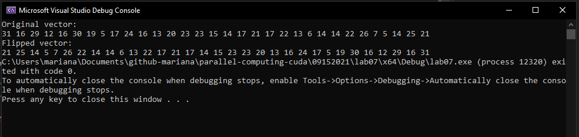

# Practice

- `cudaDeviceSynchronize();` checks **if** there's some process in kernel to wait for, else it continues normally with host lines.

## Lab 07

Code a program in c/c++ using CUDA in which you implement a kernel that inverts the order of the elements of an integer vector filled randomly, and that saves the values in another vector considering the requirements:

- 32 threads

- 1 block of 1 dimension

- The kernel must be: `__global__ void flipVector(int* vector, int* flippedVector)`

- Include error management using the following function: `__host__ void checkCUDAError(const char* msg)`

### Solution

```c++
#include "cuda_runtime.h"
#include "device_launch_parameters.h"

#include <stdio.h>
#include <stdlib.h>

#include <stdlib.h> /* srand, rand */
#include <time.h> /* time */

__host__ void checkCUDAError(const char* msg) {
	cudaError_t error;
	cudaDeviceSynchronize(); 
	error = cudaGetLastError(); 
	if (error != cudaSuccess) {
		printf("ERROR %d: %s (%s)\n", error, cudaGetErrorString(error), msg);
	}
}

__global__ void flipVector(int* vector, int* flippedVector) {
	int gId = threadIdx.x + blockIdx.x * blockDim.x;
	flippedVector[(blockDim.x - 1) - gId] = vector[gId];
}

int main() {
	const int vectorSize = 32;
	int* vector = (int*)malloc(sizeof(int) * vectorSize);
	int* flippedVector = (int*)malloc(sizeof(int) * vectorSize);

	int* devVector, * devFlippedVector;
	cudaMalloc((void**)&devVector, sizeof(int) * vectorSize);
	checkCUDAError("cudaMalloc: devVector");
	cudaMalloc((void**)&devFlippedVector, sizeof(int) * vectorSize);
	checkCUDAError("cudaMalloc: devFlippedVector");

	srand(time(NULL));
	printf("Original vector: \n");
	for (int i = 0; i < vectorSize; i++) {
		int num = rand() % vectorSize + 1;
		vector[i] = num;
		printf("%d ", vector[i]);
	}

	cudaMemcpy(flippedVector, vector, sizeof(int) * vectorSize, cudaMemcpyHostToHost);
	checkCUDAError("cudaMemcpy: vector -> flippedVector, Host -> Host");
	cudaMemcpy(devVector, vector, sizeof(int) * vectorSize, cudaMemcpyHostToDevice);
	checkCUDAError("cudaMemcpy: vector -> devVector, Host -> Device");
	cudaMemcpy(devFlippedVector, flippedVector, sizeof(int) * vectorSize, cudaMemcpyHostToDevice);
	checkCUDAError("cudaMemcpy: flippedVector -> devFlippedVector, Host -> Device");

	dim3 grid(1);
	dim3 block(vectorSize);

	flipVector << < grid, block >> > (devVector, devFlippedVector);
	checkCUDAError("kernel: flipVector");

	cudaMemcpy(flippedVector, devFlippedVector, sizeof(int) * vectorSize, cudaMemcpyDeviceToHost);
	checkCUDAError("cudaMemcpy: devFlippedVector -> flippedVector, Device -> Host");

	printf("\nFlipped vector: \n");
	for (int i = 0; i < vectorSize; i++) {
		printf("%d ", flippedVector[i]);
	}
}
```

### Output

