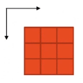
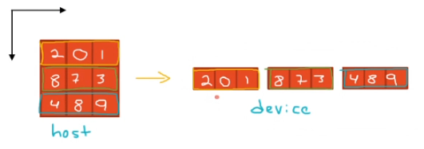
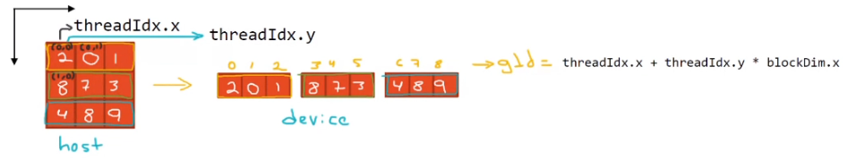
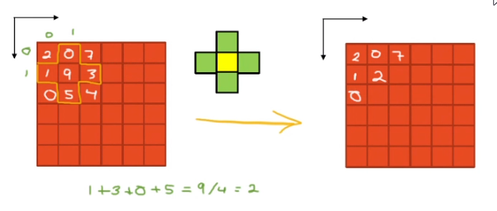
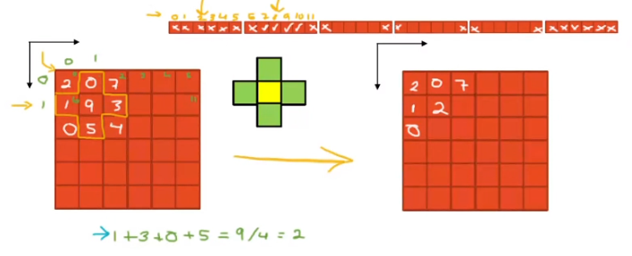
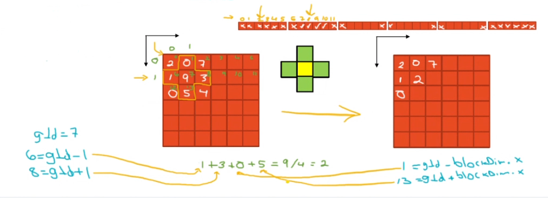

# Matrix Configurations

- The ideal is to configure the block/grid according to the data you need to process: when wroking with vectors, configure grid/blocks as vectors, when working with images, configure grid/blocks as matrix.

    - When working with one image, the block config must be a matrix too.



- The kernel must always receive a **vector of information** as a parameter even though our data is a matrix, like an image. Inside the kernel we then need to unfold the matrix so that we can access an image like a vector. Thus, we need to transform the matrix to a vector only in the process of **data transference** between host and device, so that the device receives it as a vector then. But the kernel can be configured as a matrix:

```c++
dim3 grid(1);
dim3 block(3,3); // (3,3,1)
```



- The idea is to send n x m threads for a n x m image.

- The coordinates to locate a thread in a single-block grid inside its 2D block are (`threadIdx.x`, `threadIdx.y`). So, if we have a config in the form of a matrix, we need to unfold this 2D matrix block config in order to calculate the global ID, and this id will be used to access the vector we have as a param. The globalId now is calculated as:

> gId = threadIdx.x + threadIdx.y * blockDim.x

- The `threadIdx.y * blockDim.x` tells you how many rows to skip downwards through the 'Y' component.



### Example 01

Sum of matrices

```c++
#include "cuda_runtime.h"
#include "device_launch_parameters.h"

#include <stdio.h>
#include <stdlib.h>

__host__ void checkCUDAError(const char* msg) {
	cudaError_t error;
	cudaDeviceSynchronize();
	error = cudaGetLastError();
	if (error != cudaSuccess) {
		printf("ERROR %d: %s (%s)\n", error, cudaGetErrorString(error), msg);
	}
}

__global__ void matrixSum(int* dev_a, int* dev_b, int* dev_c) {
	int gId = threadIdx.x + threadIdx.y * blockDim.x;
	dev_c[gId] = dev_a[gId] + dev_b[gId];
}

int main() {
	const int N = 3; // if 32 ok, if 33 ERROR 9: invalid configuration argument (matrixSum kernel error) and c mat is zeroed

	int* host_a = (int*)malloc(sizeof(int) * N * N);
	int* host_b = (int*)malloc(sizeof(int) * N * N);
	int* host_c = (int*)malloc(sizeof(int) * N * N);

	int* dev_a, * dev_b, * dev_c;
	cudaMalloc((void**)&dev_a, sizeof(int) * N * N);
	cudaMalloc((void**)&dev_b, sizeof(int) * N * N);
	cudaMalloc((void**)&dev_c, sizeof(int) * N * N);

	// init data
	for (int i = 0; i < N * N; i++) {
		host_a[i] = (int)(rand() % 10);
		host_b[i] = (int)(rand() % 10);
	}

	cudaMemcpy(dev_a, host_a, sizeof(int) * N * N, cudaMemcpyHostToDevice);
	cudaMemcpy(dev_b, host_b, sizeof(int) * N * N, cudaMemcpyHostToDevice);

	dim3 block(N, N);
	dim3 grid(1);

	matrixSum << < grid, block >> > (dev_a, dev_b, dev_c);
	checkCUDAError("matrixSum kernel error");

	cudaMemcpy(host_c, dev_c, sizeof(int) * N * N, cudaMemcpyDeviceToHost);

	printf("\nMatrix A: \n");
	for (int i = 0; i < N; i++) {
		for (int j = 0; j < N; j++) {
			printf("%d ", host_a[j + i * N]);
		}
		printf("\n");
	}

	printf("\nMatrix B: \n");
	for (int i = 0; i < N; i++) {
		for (int j = 0; j < N; j++) {
			printf("%d ", host_b[j + i * N]);
		}
		printf("\n");
	}

	printf("\nMatrix C: \n");
	for (int i = 0; i < N; i++) {
		for (int j = 0; j < N; j++) {
			printf("%d ", host_c[j + i * N]);
		}
		printf("\n");
	}

	free(host_a);
	free(host_b);
	free(host_c);
	cudaFree(dev_a);
	cudaFree(dev_b);
	cudaFree(dev_c);
}
```

- The property `maximumThreadsPerBlock` will tell us how big the matrix can be in order to have a thread per cell. For a 1024 limit, the matrix would be 32 x 32.

## Image Processing: blur mask

The objective is, given a matrix of information, apply a blur filter using that matrix.

- Without considering the borders:



- The border threads will not do anything, and this is managed by knowing its global Id. In order to do that, we need to unfold the matrix block config as a vector



- Now, we will use the calculated gId to get the element of the vector of information that we need to sum as a neighbour, so that each cell can now contain the average of its four neighbours.

