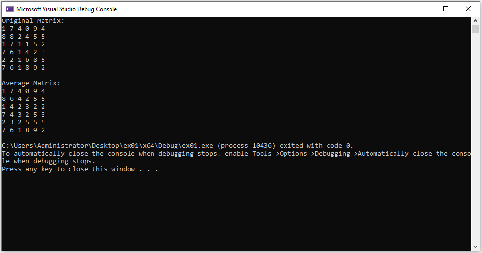

# Matrix Configurations: Practice


- When we have information in matrix form, it is convenient to configure the threads in a block (block's config) as a matrix too, so that processing is easier.

- The task here is to compute the gId out of a 2D block config in order to access the vector parameter (matrix of info) that is inside the device.

- Each thread will process one cell of the matrix of information.

- Each line of code inside the kernel will be executed N times in parallel, through the N threads.

- The gId will be used to index both the information vector and the result vector inside the kernel.

## Lab 08

Code a program in c/c++ using CUDA in which you implement a kernel that calculates the values of a matrix B considering the average of the 4 neighbours with respect to the information of a matrix A, and considering the requirements:

- 36 threads

- 1 2D block of 6 x 6 threads

- A and B matrices of size 6 x 6

- Matrix A must initialized with random integer values from 0 to 9

- Include error management with a function `__host__ void checkCUDAError(const char* msg)`

### Solution

```c++
#include "cuda_runtime.h"
#include "device_launch_parameters.h"

#include <stdio.h>
#include <stdlib.h>

__host__ void checkCUDAError(const char* msg) {
	cudaError_t error;
	cudaDeviceSynchronize();
	error = cudaGetLastError();
	if (error != cudaSuccess) {
		printf("ERROR %d: %s (%s)\n", error, cudaGetErrorString(error), msg);
	}
}

__global__ void kernel(int* m, int* r) {
	int gId = threadIdx.x + threadIdx.y * blockDim.x;
	int n1 = gId - 1;
	int n2 = gId + 1;
	int n3 = gId - blockDim.x;
	int n4 = gId + blockDim.x;
	if (threadIdx.x == 0 || threadIdx.x == (blockDim.x - 1) || threadIdx.y == 0 || threadIdx.y == (blockDim.y - 1)) {
		r[gId] = m[gId];
	}
	else {
		int avg = (m[n1] + m[n2] + m[n3] + m[n4]) / 4;

		r[gId] = avg;
	}
}

int main() {
	const int size = 6;

	int m[size][size] = { 0 };
	int r[size][size] = { 0 };
	int m_vec[size * size] = { 0 };
	int r_vec[size * size] = { 0 };

	int* dev_m, * dev_r;
	cudaMalloc((void**)&dev_m, sizeof(int) * size * size);
	checkCUDAError("Error at cudaMalloc for dev_m");
	cudaMalloc((void**)&dev_r, sizeof(int) * size * size);
	checkCUDAError("Error at cudaMalloc for dev_r");

	for (int i = 0; i < size; i++) {
		for (int j = 0; j < size; j++) {
			m[i][j] = (int)(rand() % 10);
			m_vec[j + i * size] = m[i][j];
		}
	}

	printf("Original Matrix:\n");
	for (int i = 0; i < size; i++) {
		for (int j = 0; j < size; j++) {
			printf("%d ", m[i][j]);
		}
		printf("\n");
	}

	for (int i = 0; i < size * size; i++) {
		//printf("%d ", m_vec[i]);
	}
	printf("\n");

	cudaMemcpy(dev_m, m_vec, sizeof(int) * size * size, cudaMemcpyHostToDevice);
	checkCUDAError("Error at cudaMemcpy Host -> Device");

	dim3 grid(1);
	dim3 block(size, size);
	kernel << < grid, block >> > (dev_m, dev_r);
	checkCUDAError("Error at kernel");

	cudaMemcpy(r_vec, dev_r, sizeof(int) * size * size, cudaMemcpyDeviceToHost);
	checkCUDAError("Error at cudaMemcpy Device -> Host");

	printf("Average Matrix:\n");
	for (int i = 0; i < size; i++) {
		for (int j = 0; j < size; j++) {
			r[i][j] = r_vec[j + i * size];
			printf("%d ", r[i][j]);
		}
		printf("\n");
	}

	cudaFree(dev_m);
	cudaFree(dev_r);
}
```

### Output


