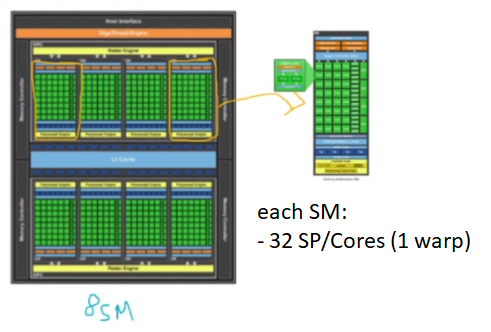
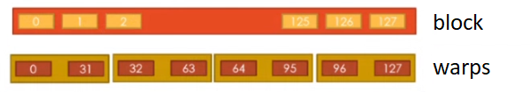
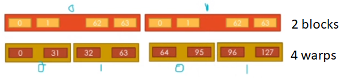
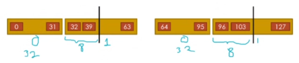
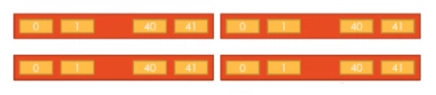
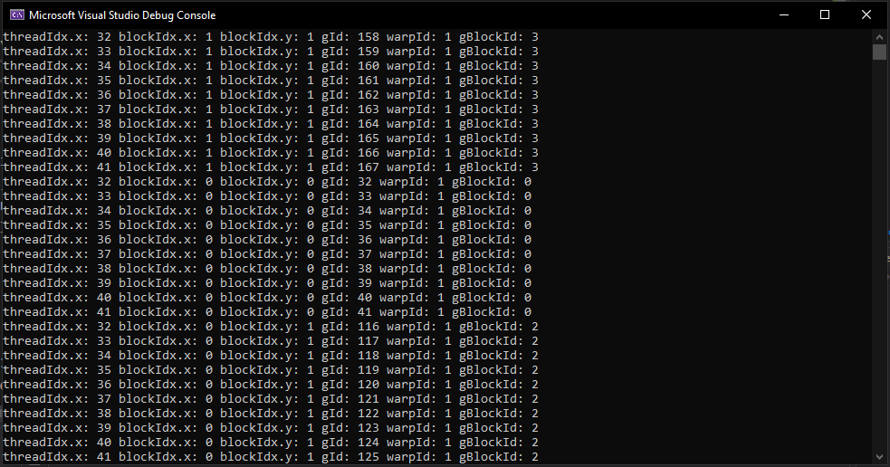

# Warps and Thread Launching

- A kernel config in the form of a matrix block is appropiate when our data has the same form of a matrix. It is appropiate because with the same way that we identify the threads launched through the kernel, that same index that allows us to identify threads is used also to identify the data we want to process. Therefore, it is doubly convenient: threads in the same form that our data.

- When we work with big matrices, we cannot use just one block, because it can only be 32 x 32. We need to use various blocks: with which configs? Through which axes?

## Warps

- There is a property that shows you the size of the warp (warpSize): a warp is a **basic unit** constituted of 32 consecutive threads, and it will aid us to decide the block config to use. 

- These 32 consecutive threads inside a warp use the SIMT modality (Single Instruction Multiple Threads) when executed in parallel: One instruction executed by multiple (each) threads. This means that each thread will execute the same instructions but with different data, its **own** variables or memory. 

- All threads inside a block are divided into warps. Each thread will be executed in a streaming processor (SP) or CUDA Core or Nucleus. **Each block is executed in a Streaming Multiprocessor (SM), which has 32 small squares (SP) / 1 warp, if this block qty is exceeded, waiting time is required.** If a SM has 64 SP (2 warps), that means that the SM has the capacity to run 2 warps in real parallel.



*Therefore, each SM can process in parallel 32 threads (1 warp).*

- Only 32(SP per SM) x 8(SM's) = 256 threads will be run in real parallelism using all GPU resources on this 8SM/32 SP example. Otherwise (more threads launched), there will be some waiting time.

- A warp is a **basic unit** that will help us with the decision of which block config to use. Each SM is divided into warps. 


- Imagine we have 8 blocks with 128 threads each = 1024 threads, when in reality we have 8 (SM) x 32 (SP) = 256 in real parallel. Thus, each of those 128 threads are divided into warps: 4 warps per block. Each block will be divided into 4, and what will happen is that each warp of 32 threads will be taken and so on, until you run the 128 threads in 8 SM's, giving the 1024 threads you wanted in total.

	### 1 block, 128 threads

	

	*Note: a) in this config, all warps will be executed (maybe in line) in 1 SM unit. Slower, 1 SM for 128 (you wait 4 times).*

    - You need 4 warps to execute a 128 thread block: a SM can only run 1 warp (32 th) at the same time. If you config a warp per SM (or more, depending on how many cores the SM has), all SM's will run its warp in parallel and avoid the waiting time.

    - An SM has a number of threads, which will be grouped in warps. The SM runs all its threads (warps) in parallel. In this examples, we are saying that an SM runs only 32 threads or 1 warp in parallel.

	

	*Note: b) in this config, the first 2 warps will be executed in 1 SM, and the other 2 warps in another SM, because they are in different blocks. Faster, 1 SM for 64 (you wait 2 times). Thus, if we launch 4 blocks with 32 threads each, we would be executing all in parallel (32 threads per SM) ans still launch 128 threads. All SM's run independently their warps (block). The two-block config is slower because you're giving 64 threads to 2 SM's that run 1 warp, and in the four-block config you're giving 32 threads to 4 SM's that run 1 warp.*

    - Warps continue the gIds from the past warp executed: each thread will have its global id following the last id from the last thread in the last warp executed. In the end, **all threads are put along the x axis with consecutive global ids**.

- The block config affects the execution time: it is advised that the block config is always a multiple of 32 (warp): you can loose time and also waste threads launched because of other configs.

- In order to accelerate the process, try to divide the threads into the most SM units (blocks) as posible. Try also to **always have a block config that is a multiple of 32**. What if not?

	- If we launch 2 block with 40 threads each (80 total threads), we will need 4 warps, and not 3. This because **each block is divided separately into warps**. If you have 1 block with 40 threads, you will need on *that* block 2 warps: 32 in one and 8 in another. Same thing with the next block = 4 warps.

	

	- Therefore, to launch 80 threads with this config we will need 4 warps = 128 threads, with 48 inactive threads. When we do not configure in 32 multiples, we use more threads than necessary: this is why we need multiples of 32, so that there are **no wasted** threads. Even if you launch a kernel with a single thread block, CUDA will need 1 warp / 32 threads.

## Lab 09

If we were to launch 4 block with 42 threads each, how many warps would we need? The answer is 8 warps. Therefore, we would be reserving 256 threads to launch 168 active threads.



Write a program in c/c++ using CUDA in which you implement a kernel that prints the following info for each thread:

- The thread index (threadIdx.x)

- The block index along x (blockIdx.x)

- The block index along y (blockIdx.y)

- The global index (gId)

- The index of the warp that it belongs to (warpId)

- The global block index (gBlockId)

Consider the following requirements for the launch of the kernel:

- Blocks of 42 threads in 1D

- A grid of 2 x 2 blocks

- The kernel must be: `__global__ void warpDetails()`

### Solution

```c++
#include "cuda_runtime.h"
#include "device_launch_parameters.h"

#include <stdio.h>
#include <stdlib.h>

__host__ void checkCUDAError(const char* msg) {
	cudaError_t error;
	cudaDeviceSynchronize();
	error = cudaGetLastError();
	if (error != cudaSuccess) {
		printf("ERROR %d: %s (%s)\n", error, cudaGetErrorString(error), msg);
	}
}

__global__ void warpDetails() {
	int gId = blockIdx.y * (gridDim.x * blockDim.x) + (blockIdx.x * blockDim.x) + threadIdx.x;
	int warpId = threadIdx.x / 32; // index of warp per block, not unique
	int gBlockId = blockIdx.y * gridDim.x + blockIdx.x;
	printf("threadIdx.x: %d blockIdx.x: %d blockIdx.y: %d gId: %d warpId: %d gBlockId: %d\n", threadIdx.x, blockIdx.x, blockIdx.y, gId, warpId, gBlockId);
}

int main() {
	dim3 block(42);
	dim3 grid(2, 2);
	warpDetails << < grid, block >> > ();
	checkCUDAError("Error at kernel");

	return 0;
}
```

### Output



