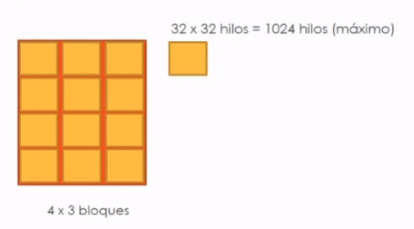
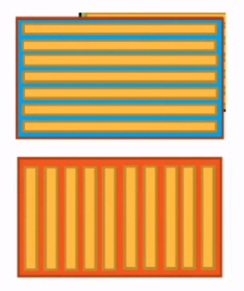
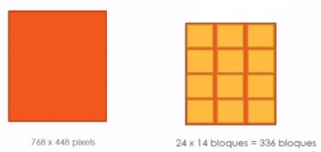
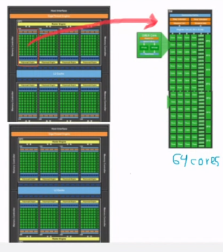

# GPU Specs Meaning

## Summary

### Basics

----

- 1 warp is the basic unit and it is constituted of 32 consecutive threads.

- All threads in a warp are executed in parallel using the modality SIMT (Single Instruction Multiple Thread).

    - SIMT means that every thread executes the same instruction but using their own copy of data, their own memory.

- The threads in a block are divided into warps.

- Each block is executed in one SM unit (Streaming Multiprocessor / Processor / Multiprocessor).

- Each thread is executed in one core.

### Specifics

----

- Even if a block is launched with only one thread, CUDA will assign a warp of 32 threads, and so only one thread will be active and 32 threads inactive.

- Even though threads in a warp are inactive, CUDA reserves resources for all of them, that is, the resources are reserved for the whole warp.

- To have inactive threads in a warp means a lot of wasted resources.

- It is recommended to configure the number of threads in a block (block config) in multiples of 32 to assure that all threads are in an active state.

## Example 1

- Due to the fact that the info is now an image (matrix), the amount of operations to perform is n x m, in this case, 128 x 96 = 12 288 pixels of information. 

- Let's divide the image into blocks, where each block contains or processes a certain amount of pixels. Each block would be a 32 x 32 matrix of image pixels. In this way, we obtain 4 x 3 blocks of 32 by 32 each. The grid config for the kernel launch would be `grid(3, 4, 1)` and the idea is to use each SM to process a block of 32 x 32 (1024 threads) in parallel.

*Note: another config could be 12 1D blocks of 1024 (multiple of 32) threads along the x or y axis*

- If all configs use the maximum amount of resources without wasting threads (blocks multiples of 32), then you choose the one that is more natural to program.

## Example 2

- In this image, we now the grid config (block quantities per axis) just by dividing the dimensions 768 x 448 by 32 and we get `grid(14, 24, 1)`. Thus, 14 x 24 = 336 square blocks of 32 x 32. The 32 x 32 = 1024, which are the threads in `maxThreadsPerBlock` or in a block, not per SM. Each of these blocks would be executed by one SM, because of i). We only have 16 SM and we have 336 blocks, so in each multiprocessor there will be 21 blocks per SM, **with some waiting time**: virtually or in software would be parallel, but not at hardware level. At hardware or real parallel, it must be the number given by NVIDIA.

### Careful with Your Configs

| a) name | b) NVIDIA CUDA Cores (webpage) | c) multiProcessorCount (SM units) | d) Cores / SM | e) maxThreadsPerMultiProcessor | f) maxBlocksPerMultiProcessor |
| ---- | ---- | ---- | ---- | ---- | ---- |
| NVIDIA GeForce GTX 1650 | 1024 | 16 | 64 | 1024 | 16 |
| NVIDIA GeForce GTX 1080 | 2560 | 20 | 128 | 2048 | 32 |
| NVIDIA GeForce GTX 960M | 640 | 5 | 128 | 2048 | 32 |

### Total Capacity

| NVIDIA GeForce GTX 1650 | NVIDIA GeForce GTX 1080 | NVIDIA GeForce GTX 960M
| ---- | ---- | ---- |
| 1 block of 1024 / SM | 1 block of 2048 / SM | 1 block of 2048 / SM |
| 16 blocks of 64 / SM (16 x 64 = 1024) | 32 blocks of 64 / SM (32 x 64 = 2048) | 32 blocks of 64 / SM (32 x 64 = 2048) |
| 16 blocks of 1024 total = 16 384 | 20 blocks of 2048 total = 40 960 | 5 blocks of 2048 total = 10 240 |
| 256 blocks of 64 total = 16 384 | 640 (32 x 20) blocks of 64 total = 40 960 | 160 (32 x 5) blocks of 64 total = 10 240 |
| 16 blocks of 64 (d) = 1024 **real parallel** | 20 blocks of 128 (d) = 2560 **real parallel** | 5 blocks of 128 (d) = 640 **real parallel** |

- CUDA Cores Per SM (Multiprocessor) = 1024 (b) / 16 (c) = 64 cores per SM. This tells us that we can execute in **real parallel** 2 warps per SM *.

    - `maxThreadsPerMultiprocessor` = 1024 tells us that we can process more than 64 threads as a maximum limit per SM. This 1024 number means that:

        - i) we can launch 1 block of 1024 threads per SM. But also because of `maxBlocksPerMultiprocessor` = 16, we can also launch 16 blocks that do not supass 1024 threads. Thus, also ii) 16 blocks of 64 threads (*coinciding with the core capacity of 64/2 warps) per SM. But these exceed the 64 threads in real parallel, so these two configs would be executed **within some waiting time**.

        - i) `multiProcessorCount` = 16, plus the above fact of `maxThreadsPerMultiprocessor` = 1024, we can launch 16 blocks of 1024 threads each **in total** as maximum capacity, which sums a total of 16384 threads. ii) With 16 blocks per SM (also 16), we can have a total of 256 blocks of 64 threads each block **in total** as well, summing 16384 threads. These two totals also mean **within some waiting time**.

        - In real parallel? 16 blocks (one per SM) with 64 threads, 16 x 64 = 1024. Each block would process 64 threads in real parallel. This 1024 must coincide with CUDA Cores info from NVIDIA.

    - A block is executed in an SM unit. But, by having `maxBlocksPerMultiprocessor`, we conclude that we can execute more than one block, with waiting time.

## Handy Links

- https://www.nvidia.com/en-us/geforce/gaming-laptops/geforce-gtx-960m/specifications/