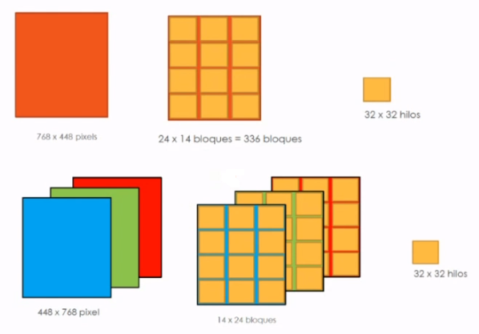
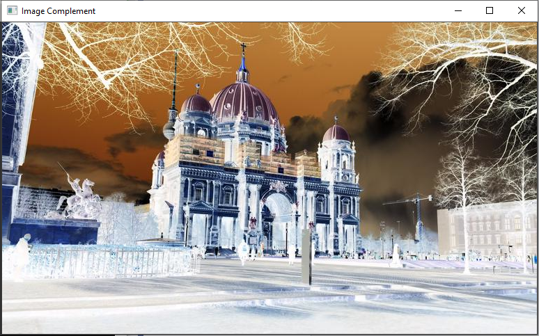
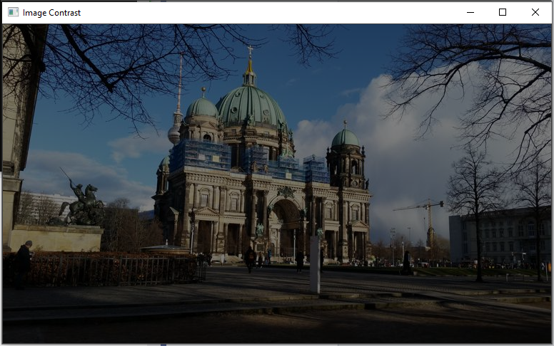
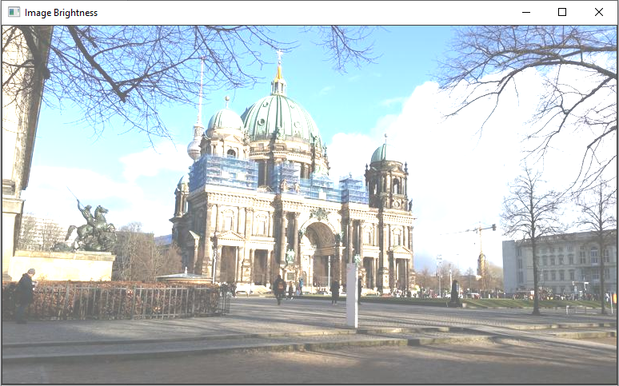

# RGB Image Manipulation Using CUDA: Practice

To process an image in RGB, we just need to apply what we did for a grayscale image but three times, each for an RGB channel: have a matrix (vector) of data for channel R, G and B.



## Lab 11

Write a program in c/c++ using CUDA in which you implement a kernel to modify the contrast of an RGB image, and another to modify the brightness, considering the following requirements:

- Blocks of 32 x 32 threads

- The kernel for complement, contrast and brightness should be:

    - `__global__ void complement(uchar* R, uchar* G, uchar* B)`

    - `__global__ void contrast(uchar* R, uchar* G, uchar* B, float fc)`

    - `__global__ void brightness(uchar* R, uchar* G, uchar* B, float fb)`

- Include error management with a function:

    - `__host__ void checkCUDAError(const char* msg)`

### Input


### Solution

```c++
#include "cuda_runtime.h"
#include "device_launch_parameters.h"

#include <stdio.h>
#include <stdlib.h>
#include <opencv2/opencv.hpp>

__host__ void checkCUDAError(const char* msg) {
	cudaError_t error;
	cudaDeviceSynchronize();
	error = cudaGetLastError();
	if (error != cudaSuccess) {
		printf("ERROR %d: %s (%s)\n", error, cudaGetErrorString(error), msg);
	}
}

__global__ void complement(uchar* R, uchar* G, uchar* B) {
	// locate my current block row
	int threads_per_block = blockDim.x * blockDim.y;
	int threads_per_row = threads_per_block * gridDim.x;
	int row_offset = threads_per_row * blockIdx.y;

	// locate my current block column
	int block_offset = blockIdx.x * threads_per_block;
	int threadId_inside = blockDim.x * threadIdx.y + threadIdx.x;

	int gId = row_offset + block_offset + threadId_inside;
	R[gId] = 255 - R[gId];
	G[gId] = 255 - G[gId];
	B[gId] = 255 - B[gId];
}

__global__ void contrast(uchar* R, uchar* G, uchar* B, float fc) {
	// locate my current block row
	int threads_per_block = blockDim.x * blockDim.y;
	int threads_per_row = threads_per_block * gridDim.x;
	int row_offset = threads_per_row * blockIdx.y;

	// locate my current block column
	int block_offset = blockIdx.x * threads_per_block;
	int threadId_inside = blockDim.x * threadIdx.y + threadIdx.x;

	int gId = row_offset + block_offset + threadId_inside;
	if (fc * R[gId] > 255) { R[gId] = 255; } else { R[gId] = fc * R[gId]; }
	if (fc * G[gId] > 255) { G[gId] = 255; } else { G[gId] = fc * G[gId]; }
	if (fc * B[gId] > 255) { B[gId] = 255; } else { B[gId] = fc * B[gId]; }
}

__global__ void brightness(uchar* R, uchar* G, uchar* B, float fb) {
	// locate my current block row
	int threads_per_block = blockDim.x * blockDim.y;
	int threads_per_row = threads_per_block * gridDim.x;
	int row_offset = threads_per_row * blockIdx.y;

	// locate my current block column
	int block_offset = blockIdx.x * threads_per_block;
	int threadId_inside = blockDim.x * threadIdx.y + threadIdx.x;

	int gId = row_offset + block_offset + threadId_inside;
	if (fb >= 0){
	if (fb + R[gId] > 255) { R[gId] = 255; } else { R[gId] = fb + R[gId]; }
	if (fb + G[gId] > 255) { G[gId] = 255; } else { G[gId] = fb + G[gId]; }
	if (fb + B[gId] > 255) { B[gId] = 255; } else { B[gId] = fb + B[gId]; }
	}
	
	if (fb < 0) {
	if (fb + R[gId] < 0) { R[gId] = 0; } else { R[gId] = fb + R[gId]; }
	if (fb + G[gId] < 0) { G[gId] = 0; } else { G[gId] = fb + G[gId]; }
	if (fb + B[gId] < 0) { B[gId] = 0; } else { B[gId] = fb + B[gId]; }
	}
}

using namespace cv;
int main() {

	Mat img = imread("antenaRGB.jpg");

	const int R = img.rows;
	const int C = img.cols;

	Mat imgComp(img.rows, img.cols, img.type());
	Mat imgCont(img.rows, img.cols, img.type());
	Mat imgBright(img.rows, img.cols, img.type());
	uchar* host_r, * host_g, * host_b, * dev_r1, * dev_g1, * dev_b1, * dev_r2, * dev_g2, * dev_b2, * dev_r3, * dev_g3, * dev_b3;
	host_r = (uchar*)malloc(sizeof(uchar) * R * C);
	host_g = (uchar*)malloc(sizeof(uchar) * R * C);
	host_b = (uchar*)malloc(sizeof(uchar) * R * C);

	cudaMalloc((void**)&dev_r1, sizeof(uchar) * R * C);
	checkCUDAError("Error at malloc dev_r1");
	cudaMalloc((void**)&dev_g1, sizeof(uchar) * R * C);
	checkCUDAError("Error at malloc dev_g1");
	cudaMalloc((void**)&dev_b1, sizeof(uchar) * R * C);
	checkCUDAError("Error at malloc dev_b1");

	cudaMalloc((void**)&dev_r2, sizeof(uchar) * R * C);
	checkCUDAError("Error at malloc dev_r2");
	cudaMalloc((void**)&dev_g2, sizeof(uchar) * R * C);
	checkCUDAError("Error at malloc dev_g2");
	cudaMalloc((void**)&dev_b2, sizeof(uchar) * R * C);
	checkCUDAError("Error at malloc dev_b2");

	cudaMalloc((void**)&dev_r3, sizeof(uchar) * R * C);
	checkCUDAError("Error at malloc dev_r3");
	cudaMalloc((void**)&dev_g3, sizeof(uchar) * R * C);
	checkCUDAError("Error at malloc dev_g3");
	cudaMalloc((void**)&dev_b3, sizeof(uchar) * R * C);
	checkCUDAError("Error at malloc dev_b3");

	// matrix as vector
	for (int i = 0; i < R; i++) {
		for (int j = 0; j < C; j++) {
			Vec3b pix = img.at<Vec3b>(i, j);
			host_r[i * C + j] = pix[2];
			host_g[i * C + j] = pix[1];
			host_b[i * C + j] = pix[0];
		}
	}
	cudaMemcpy(dev_r1, host_r, sizeof(uchar) * R * C, cudaMemcpyHostToDevice);
	checkCUDAError("Error at memcpy host_r -> dev_r1");
	cudaMemcpy(dev_g1, host_g, sizeof(uchar) * R * C, cudaMemcpyHostToDevice);
	checkCUDAError("Error at memcpy host_r -> dev_g1");
	cudaMemcpy(dev_b1, host_b, sizeof(uchar) * R * C, cudaMemcpyHostToDevice);
	checkCUDAError("Error at memcpy host_r -> dev_b1");

	cudaMemcpy(dev_r2, host_r, sizeof(uchar) * R * C, cudaMemcpyHostToDevice);
	checkCUDAError("Error at memcpy host_r -> dev_r2");
	cudaMemcpy(dev_g2, host_g, sizeof(uchar) * R * C, cudaMemcpyHostToDevice);
	checkCUDAError("Error at memcpy host_r -> dev_g2");
	cudaMemcpy(dev_b2, host_b, sizeof(uchar) * R * C, cudaMemcpyHostToDevice);
	checkCUDAError("Error at memcpy host_r -> dev_b2");

	cudaMemcpy(dev_r3, host_r, sizeof(uchar) * R * C, cudaMemcpyHostToDevice);
	checkCUDAError("Error at memcpy host_r -> dev_r3");
	cudaMemcpy(dev_g3, host_g, sizeof(uchar) * R * C, cudaMemcpyHostToDevice);
	checkCUDAError("Error at memcpy host_r -> dev_g3");
	cudaMemcpy(dev_b3, host_b, sizeof(uchar) * R * C, cudaMemcpyHostToDevice);
	checkCUDAError("Error at memcpy host_r -> dev_b3");

	dim3 block(32, 32);
	dim3 grid(C / 32, R / 32);

	complement << < grid, block >> > (dev_r1, dev_g1, dev_b1);
	cudaDeviceSynchronize();
	checkCUDAError("Error at kernel complement");

	cudaMemcpy(host_r, dev_r1, sizeof(uchar) * R * C, cudaMemcpyDeviceToHost);
	checkCUDAError("Error at memcpy host_r <- dev_r1");
	cudaMemcpy(host_g, dev_g1, sizeof(uchar) * R * C, cudaMemcpyDeviceToHost);
	checkCUDAError("Error at memcpy host_r <- dev_g1");
	cudaMemcpy(host_b, dev_b1, sizeof(uchar) * R * C, cudaMemcpyDeviceToHost);
	checkCUDAError("Error at memcpy host_r <- dev_b1");

	for (int i = 0; i < R; i++) {
		for (int j = 0; j < C; j++) {
			imgComp.at<Vec3b>(i, j)[0] = host_b[i * C + j];
			imgComp.at<Vec3b>(i, j)[1] = host_g[i * C + j];
			imgComp.at<Vec3b>(i, j)[2] = host_r[i * C + j];
		}
	}

	contrast << < grid, block >> > (dev_r2, dev_g2, dev_b2, 0.5);
	cudaDeviceSynchronize();
	checkCUDAError("Error at kernel contrast");

	cudaMemcpy(host_r, dev_r2, sizeof(uchar) * R * C, cudaMemcpyDeviceToHost);
	checkCUDAError("Error at memcpy host_r <- dev_r2");
	cudaMemcpy(host_g, dev_g2, sizeof(uchar) * R * C, cudaMemcpyDeviceToHost);
	checkCUDAError("Error at memcpy host_r <- dev_g2");
	cudaMemcpy(host_b, dev_b2, sizeof(uchar) * R * C, cudaMemcpyDeviceToHost);
	checkCUDAError("Error at memcpy host_r <- dev_b2");

	for (int i = 0; i < R; i++) {
		for (int j = 0; j < C; j++) {
			imgCont.at<Vec3b>(i, j)[0] = host_b[i * C + j];
			imgCont.at<Vec3b>(i, j)[1] = host_g[i * C + j];
			imgCont.at<Vec3b>(i, j)[2] = host_r[i * C + j];
		}
	}

	brightness << < grid, block >> > (dev_r3, dev_g3, dev_b3, 100);
	cudaDeviceSynchronize();
	checkCUDAError("Error at kernel brightness");

	cudaMemcpy(host_r, dev_r3, sizeof(uchar) * R * C, cudaMemcpyDeviceToHost);
	checkCUDAError("Error at memcpy host_r <- dev_r3");
	cudaMemcpy(host_g, dev_g3, sizeof(uchar) * R * C, cudaMemcpyDeviceToHost);
	checkCUDAError("Error at memcpy host_r <- dev_g3");
	cudaMemcpy(host_b, dev_b3, sizeof(uchar) * R * C, cudaMemcpyDeviceToHost);
	checkCUDAError("Error at memcpy host_r <- dev_b3");

	for (int i = 0; i < R; i++) {
		for (int j = 0; j < C; j++) {
			imgBright.at<Vec3b>(i, j)[0] = host_b[i * C + j];
			imgBright.at<Vec3b>(i, j)[1] = host_g[i * C + j];
			imgBright.at<Vec3b>(i, j)[2] = host_r[i * C + j];
		}
	}

	imshow("Image", img);
	imshow("Image Complement", imgComp);
	imshow("Image Contrast", imgCont);
	imshow("Image Brightness", imgBright);
	waitKey(0);

	free(host_r);
	free(host_g);
	free(host_b);
	cudaFree(dev_r1);
	cudaFree(dev_g1);
	cudaFree(dev_b1);
	cudaFree(dev_r2);
	cudaFree(dev_g2);
	cudaFree(dev_b2);
	cudaFree(dev_r3);
	cudaFree(dev_g3);
	cudaFree(dev_b3);

	return 0;
}
```

## Output

### Complement



### Contrast



### Brightness

