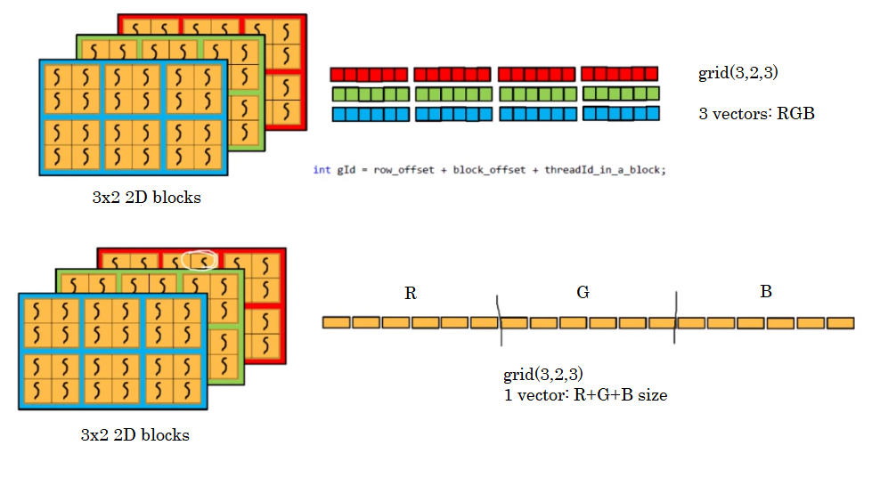

# RGB Image Manipulation: Other Options

Now, instead of processing the complement of the RGB image by reading from 3 vectors of information, let's try and read from a single vector that holds R, G and B vectors in one: vecSize x 3 this time.



### Solution

```c++
#include "cuda_runtime.h"
#include "device_launch_parameters.h"

#include <stdio.h>
#include <stdlib.h>
#include <opencv2/opencv.hpp>

__host__ void checkCUDAError(const char* msg) {
	cudaError_t error;
	cudaDeviceSynchronize();
	error = cudaGetLastError();
	if (error != cudaSuccess) {
		printf("ERROR %d: %s (%s)\n", error, cudaGetErrorString(error), msg);
	}
}

__global__ void complement(uchar* RGB) {

	// locate my current block row
	int threads_per_block = blockDim.x * blockDim.y;
	int threads_per_row = threads_per_block * gridDim.x;
	int row_offset = threads_per_row * blockIdx.y;

	// locate my current block column
	int block_offset = blockIdx.x * threads_per_block;
	int threadId_inside = blockDim.x * threadIdx.y + threadIdx.x;

	// locate my current grid row
	int thread_per_grid = (gridDim.x * gridDim.y * threads_per_block);
	int gridOffset = blockIdx.z * thread_per_grid;

	int gId = gridOffset + row_offset + block_offset + threadId_inside;
	int C = gridDim.x * 32;
	int R = gridDim.y * 32;
	RGB[gId] = 255 - RGB[gId];
}

using namespace cv;
int main() {

	Mat img = imread("antenaRGB.jpg");

	const int R = img.rows;
	const int C = img.cols;

	Mat imgComp(img.rows, img.cols, img.type());
	uchar* host_rgb,* dev_rgb;
	host_rgb = (uchar*)malloc(sizeof(uchar) * R * C * 3);

	cudaMalloc((void**)&dev_rgb, sizeof(uchar) * R * C * 3);
	checkCUDAError("Error at malloc dev_r1");

	// matrix as vector
	for (int k = 0; k < 3; k++){ 
		for (int i = 0; i < R; i++) {
			for (int j = 0; j < C; j++) {
				Vec3b pix = img.at<Vec3b>(i, j);
				
				host_rgb[i * C + j + (k * R * C)] = pix[k];
			
			}
		}
	}
	cudaMemcpy(dev_rgb, host_rgb, sizeof(uchar) * R * C * 3, cudaMemcpyHostToDevice);
	checkCUDAError("Error at memcpy host_rgb -> dev_rgb");

	dim3 block(32, 32);
	dim3 grid(C / 32, R / 32, 3);

	complement << < grid, block >> > (dev_rgb);
	cudaDeviceSynchronize();
	checkCUDAError("Error at kernel complement");

	cudaMemcpy(host_rgb, dev_rgb, sizeof(uchar) * R * C * 3, cudaMemcpyDeviceToHost);
	checkCUDAError("Error at memcpy host_rgb <- dev_rgb");

	for (int k = 0; k < 3; k++) {
		for (int i = 0; i < R; i++) {
			for (int j = 0; j < C; j++) {
				imgComp.at<Vec3b>(i, j)[k] = host_rgb[i * C + j + (k * R * C)];
			}
		}
	}
	

	imshow("Image", img);
	imshow("Image Complement", imgComp);
	waitKey(0);

	free(host_rgb);
	cudaFree(dev_rgb);

	return 0;
}
```