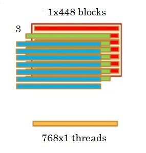
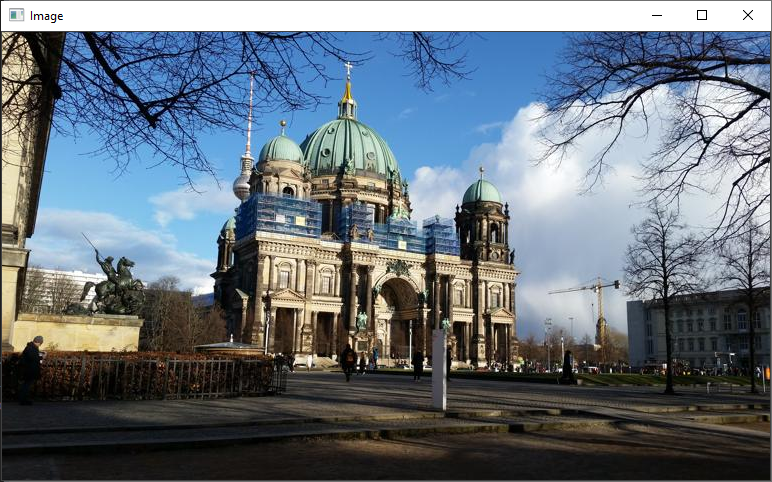
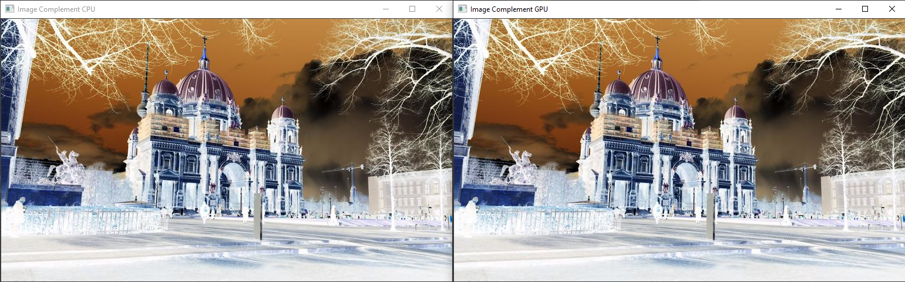
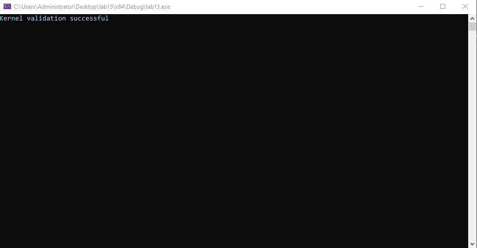

# Practice



## Lab 13

Write a program in c/c++ using CUDA in which you implement a kernel to calculate an RGB image complement. The kernel must be verified, consider the requirements:

- The complement of an image is defined as:

*I(x,y) = 255 - I(x,y)*

- Blocks of 768 x 1 threads.

- A grid of 1 x 448 x 3 blocks.

- The kernel signature should be: `__global__ void complement(uchar* RGB)`

- The CPU complement function signature should be: `__host__ void complementCPU(Mat* original, Mat* comp)`

- The kernel validation signature should be: `__host__ bool validationKernel(Mat img1, Mat img2)`

### Solution

```c++
#include "cuda_runtime.h"
#include "device_launch_parameters.h"

#include <stdio.h>
#include <stdlib.h>
#include <opencv2/opencv.hpp>

using namespace cv;

__host__ void checkCUDAError(const char* msg) {
	cudaError_t error;
	cudaDeviceSynchronize();
	error = cudaGetLastError();
	if (error != cudaSuccess) {
		printf("ERROR %d: %s (%s)\n", error, cudaGetErrorString(error), msg);
	}
}

__global__ void complement(uchar* RGB) {

	// locate my current block row
	int threads_per_block = blockDim.x;
	int threads_per_row = threads_per_block * gridDim.x;
	int row_offset = threads_per_row * blockIdx.y;

	// locate my current block column
	int block_offset = blockIdx.x * threads_per_block; 

	// locate my current grid row
	int thread_per_grid = (gridDim.x * gridDim.y * threads_per_block);
	int gridOffset = blockIdx.z * thread_per_grid;

	int gId = gridOffset + row_offset + block_offset + threadIdx.x;
	RGB[gId] = 255 - RGB[gId];
}

__host__ void complementCPU(Mat* original, Mat* comp) {
	for (int i = 0; i < original->rows; i++) {
		for (int j = 0; j < original->cols; j++) {
			comp->at<Vec3b>(i, j)[0] = 255 - original->at<Vec3b>(i, j)[0];
			comp->at<Vec3b>(i, j)[1] = 255 - original->at<Vec3b>(i, j)[1];
			comp->at<Vec3b>(i, j)[2] = 255 - original->at<Vec3b>(i, j)[2];
		}
	}
}

__host__ bool validationKernel(Mat img1, Mat img2) {
	Vec3b* pImg1, * pImg2;
	for (int k = 0; k < 3; k++) {
		for (int i = 0; i < img1.rows; i++) {
			pImg1 = img1.ptr<Vec3b>(i);
			pImg2 = img2.ptr<Vec3b>(i);
			for (int j = 0; j < img1.cols; j++) {
				if (pImg1[j][k] != pImg2[j][k]) {
					printf("Error at kernel validation\n");
					return true;
				}
			}
		}
	}
	printf("Kernel validation successful\n");
	return false;
}

int main() {

	Mat img = imread("antenaRGB.jpg");

	const int R = img.rows;
	const int C = img.cols;

	Mat imgComp(img.rows, img.cols, img.type());
	Mat imgCompCPU(img.rows, img.cols, img.type());
	uchar* host_rgb, * dev_rgb;
	host_rgb = (uchar*)malloc(sizeof(uchar) * R * C * 3);

	cudaMalloc((void**)&dev_rgb, sizeof(uchar) * R * C * 3);
	checkCUDAError("Error at malloc dev_r1");

	// matrix as vector
	for (int k = 0; k < 3; k++) {
		for (int i = 0; i < R; i++) {
			for (int j = 0; j < C; j++) {
				Vec3b pix = img.at<Vec3b>(i, j);

				host_rgb[i * C + j + (k * R * C)] = pix[k];

			}
		}
	}
	cudaMemcpy(dev_rgb, host_rgb, sizeof(uchar) * R * C * 3, cudaMemcpyHostToDevice);
	checkCUDAError("Error at memcpy host_rgb -> dev_rgb");

	//dim3 block(32, 32);
	//dim3 grid(C / 32, R / 32, 3); // 24 14
	dim3 block(C, 1, 1); // 768
	dim3 grid(1, R, 3); // 448

	complement << < grid, block >> > (dev_rgb);
	cudaDeviceSynchronize();
	checkCUDAError("Error at kernel complement");

	cudaMemcpy(host_rgb, dev_rgb, sizeof(uchar) * R * C * 3, cudaMemcpyDeviceToHost);
	checkCUDAError("Error at memcpy host_rgb <- dev_rgb");

	for (int k = 0; k < 3; k++) {
		for (int i = 0; i < R; i++) {
			for (int j = 0; j < C; j++) {
				imgComp.at<Vec3b>(i, j)[k] = host_rgb[i * C + j + (k * R * C)];
			}
		}
	}

	complementCPU(&img, &imgCompCPU);
	bool error = validationKernel(imgCompCPU, imgComp);

	if (error) {
		printf("Check kernel operations\n");
		return 0;
	}
	

	imshow("Image", img);
	imshow("Image Complement CPU", imgCompCPU);
	imshow("Image Complement GPU", imgComp);
	waitKey(0);

	free(host_rgb);
	cudaFree(dev_rgb);

	return 0;
}
```

### Input



### Output




