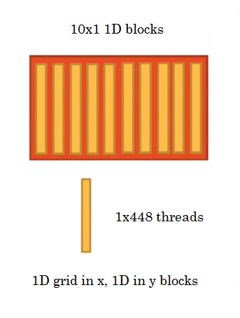
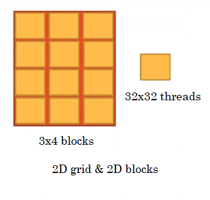

# Configs Cheatsheet

## 1D Grid & 1D Block


- Block along x axis

```c++
int gId = threadIdx.x;
```


- Block along y axis

```c++
int gId = threadIdx.y;
```

## 1D Grid & N 1D Blocks


- N 1D blocks along x axis

```c++
int threadsPerBlock = blockDim.x;
int blockOffset = threadsPerBlock * blockIdx.x;
int idInsideBlock = threadIdx.x;
int gId = blockOffset + idInsideBlock;
```

## 1D Grid & N 2D Blocks


- N 2D blocks along x axis

```c++
int threadsPerBlock = blockDim.x * blockDim.y;
int blockOffset = threadsPerBlock * blockIdx.x;
int idInsideBlock = blockDim.x * threadIdx.y + threadIdx.x;
int gId = blockOffset + idInsideBlock;
```

## 1D Grid & N 1D Blocks


- N 1D blocks along y axis

```c++
int threadsPerBlock = blockDim.x;
int rowOffset = threadsPerBlock * blockIdx.y;
int idInsideBlock = threadIdx.x;
int gId = rowOffset + idInsideBlock;
```

## 1D Grid & N 1D Blocks



- 1D grid along x and 1D blocks along its y

```c++
int threadsPerBlock = blockDim.y;
int blockOffset = threadsPerBlock * blockIdx.x;
int idInsideBlock = threadIdx.y;
int gId = blockOffset + idInsideBlock;
```

## 2D Grid & 2D Blocks



- 2D grid (x and y) and 2D blocks (x and y)

```c++
int threadsPerBlock = blockDim.x * blockDim.y;
int threadsPerRow = threadsPerBlock * gridDim.x;
int rowOffset = threadsPerRow * blockIdx.y;
int blockOffset = threadsPerBlock * blockIdx.x;
int idInsideBlock = blockDim.x * threadIdx.y + threadIdx.x;
int gId = rowOffset + blockOffset + idInsideBlock;
```

## 3D Grid & 2D Blocks


- dim3 grid(3, 4, 3) and dim3 block(32, 32, 1)

```c++
int threadsPerBlock = blockDim.x * blockDim.y;
int threadsPerRow = threadsPerBlock * gridDim.x;
int rowOffset = threadsPerRow * blockIdx.y;
int blockOffset = threadsPerBlock * blockIdx.x;
int idInsideBlock = blockDim.x * threadIdx.y + threadIdx.x;
int threadsPerGrid = threadsPerBlock * gridDim.x * gridDim.y;
int gridOffset = threadsPerGrid * blockIdx.z;
int gId = gridOffset + rowOffset + blockOffset + idInsideBlock;
```

### Exercises

What would be the gId formula for the configs below?

