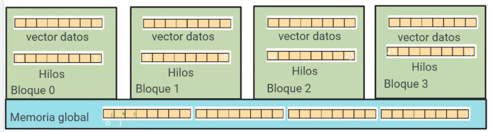

# Shared Memory with More than 1 Block

Imagine we launch four blocks in a kernel, each block with 8 threads, as shown below.


Thus, we will manipulate a vector of size 32 (4x8), the same size as the total threads launched.

In Global Memory, we have the vector thanks to `cudaMalloc()`. Global Memory is a memory that all threads from all blocks can see.

Last time, in the kernel we typed `__shared__ int vector[32]`, so that in a block there was a 32 vector in shared memory. But now, when launch many blocks the shared memory vector `__shared__ int vector[32]` will not be reserved 4 times, but the vector size will be split among all the blocks launched: each block has now a vector of size 8.

But now we need to copy from the Global Memory vector of size 32 into the shared vector size 8 in each block: the first block copies the first 8 values, and so on. The gId is computed:

> int gId = threadIdx.x + blockDim.x * blockIdx.x;

So that it looks as follows:



The block 1 cannot write anything on the shared vector of another block. Then, how to manage the shared vector indices in order to copy the global vector to the shared one? The shared vector can be accessed with the **same** indices as if it was on global memory, because the reservation is global from the kernel, and thus the indices have continuity among blocks.

```c++
__global__ void kernel(int *v){
    int gId = threadIdx.x + blockDim.x * blockIdx.x;
    __shared__ int vector[32];
    vector[gId] = v[gId];
}
```

Now, instead of partitioning the full 32 size vector, now we split into half the shared vector of size 8 that is in each block, and do the same thing over and over to perform a parallel reduction.


But what will be our step variable? Instead of 32 /2, we need 8 / 2 initially. Consider that we have the following defined macros (that are known to the kernel):

```c++
#define numThreadsPerBlock 8
#define numBlocks 4
#define vecSize numThreadsPerBlock*numBlocks
```

Thus,

```c++
__global__ void kernel(int *v){
    int gId = threadIdx.x + blockDim.x * blockIdx.x;
    __shared__ int vector[32];
    vector[gId] = v[gId];
    int step = numThreadsPerBlock / 2;
}
```

and now, how to choose the first 4 threads of each block, in order to begin the parallel reduction step?


```c++
__global__ void kernel(int *v){
    int gId = threadIdx.x + blockDim.x * blockIdx.x;
    __shared__ int vector[32];
    vector[gId] = v[gId];
    int step = numThreadsPerBlock / 2;
    if (threadIdx.x < step){ // the first 4 threads per block: 0 1 2 3
        // use gId to move from block to block spaces in the shared vector (always the first 4)
        // then add step to take the next half value and sum it up
        vector[gId] += vector[gId + step];
    }
}
```

But where is our final result? consider that the parallel reduction now is done per block:


In the end, because the block is accessing only to its shared vector piece, thus the partial sum is in the first element of each block's vector of size 8, but we cannot access them accross blocks. This is where the **global memory comes back**: we copy the number 8 in each block shared vector's first cell to the global memory vector, using the global id of such thread so that they write it in the global memory vector as:


```c++
__global__ void kernel(int *v){
    int gId = threadIdx.x + blockDim.x * blockIdx.x;
    __shared__ int vector[32];
    vector[gId] = v[gId];
    int step = numThreadsPerBlock / 2;
    if (threadIdx.x < step){ // the first 4 threads per block: 0 1 2 3
        vector[gId] += vector[gId + step];
    }
    if (threadIdx.x == 0){ // copy the partial results to the global mem vector
        v[gId] = vector[gId];
    }
}
```

Now back in the GM vector, we need to apply again a parallel reduction again, but to do that we need to copy all the 8's to the first 4 cells of the GM vector:


We will choose these 0 1 2 3 threads by choosing the threads with the gIds that are **smaller** than the number of blocks:

```c++
__global__ void kernel(int *v){
    int gId = threadIdx.x + blockDim.x * blockIdx.x;
    __shared__ int vector[32];
    vector[gId] = v[gId];
    int step = numThreadsPerBlock / 2;
    if (threadIdx.x < step){ // the first 4 threads per block: 0 1 2 3
        vector[gId] += vector[gId + step];
    }
    if (threadIdx.x == 0){ // copy the partial results to the global mem vector
        v[gId] = vector[gId];
    }
    if (gId < numBlocks){ // choose the first 4 threads to copy in the first 4 cells the partial sums
        v[gId] = v[gId*numThreadsPerBlock]; // 0 <- 0*8, 1 <- 1*8 ...
    }
}
```

Now that we have the partial sums in the beginning cells of the GM vector, we need to add all these using parallel reduction. The new step now is:

> int step = numBlocks / 2;

```c++
__global__ void kernel(int *v){
    int gId = threadIdx.x + blockDim.x * blockIdx.x;
    __shared__ int vector[32];
    vector[gId] = v[gId];
    // synch
    int step = numThreadsPerBlock / 2;
    if (threadIdx.x < step){ // the first 4 threads per block: 0 1 2 3
        vector[gId] += vector[gId + step];
        // synch
    }
    if (threadIdx.x == 0){ // copy the partial results to the global mem vector
        v[gId] = vector[gId];
        // synch
    }
    if (gId < numBlocks){ // choose the first 4 threads to copy in the first 4 cells the partial sums
        v[gId] = v[gId*numThreadsPerBlock]; // 0 <- 0*8, 1 <- 1*8 ...
        // apply parallel reduction over v
        step = numBlocks / 2;
        if (gId < step){
            v[gId] += v[gId + step];
        }
    }
    if (gId == 0){
        *sum = v[0];
    }
}
```

In the end now we have the total result of the sum in the first cell of the GM vector. Remember to synchronize threads after each shared memory vector usage.

*Note: requisite for parallel reduction is that the vector size is an even number (divisible by 2)*

### Implementation

```c++
#include "cuda_runtime.h"
#include "device_launch_parameters.h"

#include <stdio.h>
#include <stdlib.h>
#include <iostream>

#define numBlocks 8
#define threadsPerBlock 1024

using namespace std;

__host__ void checkCUDAError(const char* msg) {
	cudaError_t error;
	cudaDeviceSynchronize();
	error = cudaGetLastError();
	if (error != cudaSuccess) {
		printf("ERROR %d: %s (%s)\n", error, cudaGetErrorString(error), msg);
	}
}

__host__ void validate(int* result_CPU, int* result_GPU) {
	if (*result_CPU != *result_GPU) {
		printf("[FAILED] Kernel validation.\n");
		return;
	}
	printf("[SUCCESS] Kernel validation.\n");
	return;
}

__host__ void CPU_reduction(int* v, int* sum) {
	for (int i = 0; i < numBlocks * threadsPerBlock; i++) {
		*sum += v[i];
	}
}

__global__ void GPU_reduction(int* v, int* sum) {
	__shared__ int vector[numBlocks * threadsPerBlock];
	int gId = threadIdx.x + blockDim.x * blockIdx.x;

	vector[gId] = v[gId];
	__syncthreads();
	int step = threadsPerBlock / 2;
	while (step) {
		if (threadIdx.x < step) {
			vector[gId] = vector[gId] + vector[gId + step];
			__syncthreads();
		}
		step = step / 2;
	}
	__syncthreads();
	if (threadIdx.x == 0) { // copy the partial results to the global mem vector
		//printf("SM->vector[%d]: %d\n", gId, vector[gId]);
		v[gId] = vector[gId];
		__syncthreads();
		//printf("GM->v[%d]: %d\n", gId, v[gId]);
	}
	if (gId < numBlocks) { // choose the first 4 threads to copy in the first 4 cells the partial sums
		v[gId] = v[gId * threadsPerBlock]; // 0 <- 0*8, 1 <- 1*8 ...
		__syncthreads();
		//printf("%d<-%d\n", v[gId], v[gId * threadsPerBlock]);
	}
	int new_step = numBlocks / 2;
	while (new_step) {
		if (gId < new_step) {
			v[gId] += v[gId + new_step];
		}
		new_step = new_step / 2;
	}
	__syncthreads();
	if (gId == 0) {
		*sum = v[gId];
	}
}

int main() {

	int* dev_a, * dev_sum;
	int host_sum = 0, CPU_sum = 0;
	int* host_a = (int*)malloc(sizeof(int) * numBlocks * threadsPerBlock);
	cudaMalloc((void**)&dev_a, sizeof(int) * numBlocks * threadsPerBlock);
	cudaMalloc((void**)&dev_sum, sizeof(int));

	for (int i = 0; i < numBlocks * threadsPerBlock; i++) {
		host_a[i] = 1;
	}

	cudaMemcpy(dev_a, host_a, sizeof(int) * numBlocks * threadsPerBlock, cudaMemcpyHostToDevice);

	dim3 grid(numBlocks, 1, 1);
	dim3 block(threadsPerBlock, 1, 1);
	GPU_reduction << < grid, block >> > (dev_a, dev_sum);
	cudaDeviceSynchronize();
	checkCUDAError("Error at kernel");

	printf("N: %d\n", numBlocks * threadsPerBlock);
	cudaMemcpy(&host_sum, dev_sum, sizeof(int), cudaMemcpyDeviceToHost);
	printf("GPU result: %d\n", host_sum);

	CPU_reduction(host_a, &CPU_sum);
	printf("CPU result: %d\n", CPU_sum);

	validate(&CPU_sum, &host_sum);

	return 0;
}
```

### Output

