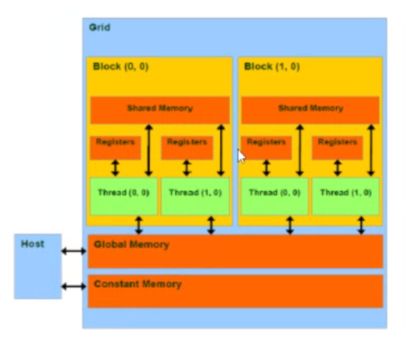
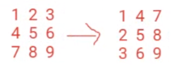
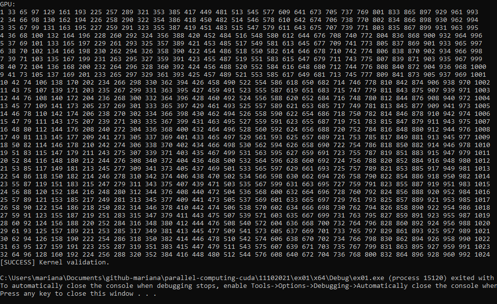

# Constant Memory

Apart from all the other memories shown in the previous diagram, we have Constant Memory:



The difference with this memory is that it is a **read-only** memory access, thus it is used from data that we just need to read. This memory is inside the Device, but its reservation it's done outside a kernel:

```c++
#define N 32
__constant__ int dev_A[N*N];
__global__ void kernel(int* dev_A, int* dev_B){

}
int main(){

}
```

Before using this constant memory, we used to send the information stored in global memory (*devPtr) as a parameter dev_A, and another vector for the results dev_B. Now, we can replace the reservation of dev_A in the Global Memory. After tne reservation, we used `cudaMemcpy()` to copy the data to dev_A. We also can forget about this step, and instead we transfer the data from the host to dev_A using `cudaMemcpyToSymbol(dev_A, host_A, sizeof(int)*N*N)`: this new function does not require the direction of the transference.

Constant Memory is advised to be used when we only have read-only data, because the memory access is faster than Global Memory.

## Implementation

Given a square matrix of size N, output the transpose of such matrix using Constant Memory. 



Generate a vector in the host: `[1,2,3,4,5,6,7,8,9]`, and copy them to the constant memory using `cudaMemcpyToSymbol(dev_A, host_A, sizeof(int)*N*N)`, now in dev_A. The result will be stored in dev_B as `[1,4,7,2,5,8,3,6,9]`. We do not need to send dev_A as parameter to the kernel, only parameter dev_B is sent. Thus, the result is in Global Memory, in dev_B. Therefore, we only need `cudaMalloc` for dev_B.

- 1 1D grid

- 1 2D block

```c++
dim3 grid(1);
dim3 block(N, N);
```

- Use validation for the kernel

### Solution

```c++
#include "cuda_runtime.h"
#include "device_launch_parameters.h"

#include <stdio.h>
#include <stdlib.h>
#include <iostream>

#define N 32
__constant__ int dev_A[N * N];

using namespace std;

__host__ void checkCUDAError(const char* msg) {
	cudaError_t error;
	cudaDeviceSynchronize();
	error = cudaGetLastError();
	if (error != cudaSuccess) {
		printf("ERROR %d: %s (%s)\n", error, cudaGetErrorString(error), msg);
	}
}

__host__ void validate(int* result_CPU, int* result_GPU) {
	for (int i = 0; i < N * N; i++) {
		if (*result_CPU != *result_GPU) {
			printf("[FAILED] The results are not equal.\n");
			return;
		}
	}
	printf("[SUCCESS] Kernel validation.\n");
	return;
}

__host__ void CPU_transpose(int* vector, int* res) {
	for (int i = 0; i < N; i++) {
		for (int j = 0; j < N; j++) {
			res[(i * N) + j] = vector[(N * j) + i];
		}
	}
}

__global__ void GPU_transpose(int* res) {
	int gId = threadIdx.x + (blockDim.x * threadIdx.y);
	res[gId] = dev_A[N * threadIdx.x + threadIdx.y];
}

__host__ void printMtx(int* mtx) {
	for (int i = 0; i < N; i++) {
		for (int j = 0; j < N; j++) {
			cout << mtx[(i * N) + j] << " ";
		}
		cout << endl;
	}
}

int main() {

	int* dev_B;
	int* host_B = (int*)malloc(sizeof(int) * N * N);
	int* cpu_B = (int*)malloc(sizeof(int) * N * N);
	int* host_A = (int*)malloc(sizeof(int) * N * N);

	cudaMalloc((void**)&dev_B, sizeof(int) * N * N);
	checkCUDAError("Error at cudaMalloc: dev_B");

	for (int i = 0; i < N * N; i++) {
		host_A[i] = i + 1;
	}

	cudaMemcpyToSymbol(dev_A, host_A, sizeof(int) * N * N);
	checkCUDAError("Error at MemcpyToSymbol");

	dim3 grid(1);
	dim3 block(N, N);
	GPU_transpose << < grid, block >> > (dev_B);
	checkCUDAError("Error at kernel");
	cudaMemcpy(host_B, dev_B, sizeof(int) * N * N, cudaMemcpyDeviceToHost);
	checkCUDAError("Error at Memcpy host_B <- dev_B");

	CPU_transpose(host_A, cpu_B);

	printf("Input: \n");
	printMtx(host_A);
	printf("CPU: \n");
	printMtx(cpu_B);
	printf("GPU: \n");
	printMtx(host_B);

	validate(cpu_B, host_B);

	free(host_B);
	free(cpu_B);
	free(host_A);
	cudaFree(dev_B);

	return 0;
}
```

### Output

